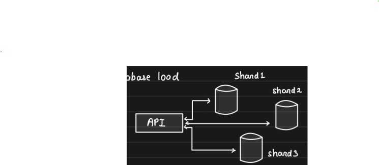

# Relational Databases

Databases are the most critical component of any system. They can make or break a system.

Data is stored and represented in **rows** and **columns**.

## History of Relational Databases

- Relational databases emerged alongside advancements in **computers**, **the internet**, and **blockchain** technologies.
- Everything revolutionary often begins with **financial applications**.
- Initially, computers were used for **accounting**:
    - Ledgers transformed into rows and columns.
    - Databases were developed to support accounting systems.

## Key Properties of Relational Databases

1. **Data Consistency**
2. **Data Durability**
3. **Data Integrity**
4. **Constraints**
5. **Everything in one place**

## Transactions in Relational Databases

Due to these properties, relational databases provide **"Transactions"**.

### ACID Properties

1. **Atomicity**

    - All statements within a transaction take effect or none of them do.
    - Example:
      ```sql
      START TRANSACTION;
      INSERT INTO posts VALUES (...);
      UPDATE stats SET total_posts = total_posts + 1 WHERE user_id = 100;
      COMMIT;
      ```

2. **Consistency**

    - Data will never go incorrect, no matter what.
    - Achieved through constraints, cascades, and triggers.
    - Example:
        - Foreign key checks prevent deleting a parent record if a child record exists.
        - Tools like constraints ensure data remains consistent.
        - Example rule: `total_posts = total entries in the posts table for a user`.

3. **Isolation**

    - When multiple transactions execute in parallel, the **isolation level** determines how much of one transaction’s changes are visible to another.
    - Diagram Example:
      ```
      Txn1 -------------------O
                     |
                     |
                     O------------------ Txn2
      ```
        - Should changes done at this point in Txn1 be visible to Txn2 before Txn1 commits?

4. **Durability**

    - When a transaction commits, the changes persist even in the event of an outage.

---

### Remember

You pick relational databases **for relations and ACID.** 📘

# Isolation levels

Relational databases provide ACID guarantees, and the "I" in ACID stands for "Isolation." Isolation levels help us tune them.

Isolation levels dictate how much one transaction knows about the other. We will look at each one of them and understand with examples.

## Repeatable Reads
Consistent reads within the same transaction, even if another transaction committed, the first transaction would not see the changes (if the value is already read).

## Read Committed
Reads within the same transaction always read fresh value.
Con: Multiple reads within the same transaction are inconsistent.

## Read Uncommitted
Reads even uncommitted values from other transactions. This is known as a "dirty read."

## Serializable
Serializable depends on engine

Every read is a locking read and while one transaction reads, others will have to wait.

* Storage engines can alter the implementation so read documentation before you alter.

# Scaling Databases

Databases are the most important component of any system out there. It makes or breaks any system...

Hence, it is critical to understand how to scale them...

* These techniques are applicable to most databases out there.
    * relational and non-relational

## Vertical Scaling

- add more CPU, RAM, Disk to the database
- requires downtime during reboot
- gives you ability to handle "scale", more load
- vertical scaling has a physical hardware limitation

## Horizontal Scaling: Read Replicas

- when read:write = 90:10
- you move reads to other database so that "master" is free to do writes
- API servers should know which DB to connect to get things done

## Replication

Changes on one database (Master) need to be sent to the Replica to maintain Consistency.

### Two Modes of Replication

1. **Synchronous Replication**
    - Strong consistency
    - Zero replication lag
    - Slower writes

2. **Asynchronous Replication**
    - Eventual consistency
    - Some replication lag
    - Faster writes

## Horizontal Scaling: Sharding

Because one node cannot handle the data/load, we split it into multiple exclusive subsets.

Writes on a particular row/document will go to one particular shard.

## Scaling Our Overall Database Load

- Note: shards are independent, no replication between them
- API server needs to know which shard to connect to, to get things done
- Some databases have a proxy that takes care of routing
- Each shard can have its own replica (if needed)

### Exercise

1. Configure one MySQL as a replica of another.
2. Put some data and see the replication happening.
3. Write a small API service that has two connection objects: one master and one replica.
4. Depending on the request, make a call to either master or replica.
5. Implement sharding by spinning up two DB instances: one handling keys (a to m) and the other handling keys (n to z).
6. Write an API service that routes requests to one of them depending on the key.

# Sharding and Partitioning

**Sharding**: method of distributing data across multiple machines

**Partitioning**: splitting a subset of data within the same instance

## How a Database is Scaled?

A database server is just a database process (mysqld, mongod) running on an EC2 machine.


### Putting Your Database in Production

Serving real traffic:


**Managing Increased User Load**

Your DB is unable to manage:

**Scale up your DB... give it more CPU, RAM, and DISK**


**Viral Product Impact**

Your bulky database is unable to handle the load, so you scale up again:


**Vertical Scaling Limits**

After a certain stage, you know you would not be able to scale "up" your DB because vertical scaling has limits.

**Resorting to Horizontal Scaling**


**Scenario:** One DB server was handling 1000 WPS, and we cannot scale up beyond that but we are getting 1500 WPS.

**Solution:** Scale horizontally and split the data.

**Outcome:** By adding one more database server, we reduce the load to 750 WPS on each node and thus handle higher throughput.


Each database server is thus a shard and we say that the data is partitioned. Overall, a database is sharded while the data is partitioned. Over simplification, most people use the terms interchangeably.


You partitioned the 100GB of total data into 5 mutually exclusive partitions. Each of these partitions can either live on one database server or a couple of them can share one server. And this depends on the #shards you have.


5 partitions of our 100GB dataset are distributed across 2 shards.

## How to Partition the Data?

There are two categories of partitioning:
1. **Horizontal Partitioning**
2. **Vertical Partitioning**

When we "split" the 100GB data, we could have used either of the ways, but deciding which one to pick depends on load, use case, and access pattern.


# Advantages and Disadvantages of Sharding

## Advantages of Sharding
- Handle large reads and writes
- Increase overall storage capacity
- Higher availability

## Disadvantages of Sharding
- Operationally complex
- Cross-shard queries expensive

# Non-Relational Databases

## Generalization of Databases

It is a very broad generalization of databases that are non-relational (MySQL, PostgreSQL, etc.).

But this does not mean all non-relational databases are similar.

## Interesting Aspects of Non-Relational Databases

What makes non-relational databases interesting?

Most non-relational databases shard out-of-the-box!!

### Horizontal Scalability

## Types of NoSQL Databases

We talk about 3 most important types of NoSQL databases:

### Document DBs (e.g., MongoDB, Elasticsearch)

- Mostly JSON based
- Supports complex queries
- Partial updates to documents possible
- Closest to relational databases
- Can perform operations like `total_posts += 1` without re-writing the entire document

### Example Applications

- In-app notification service
- Catalog service

# Key Value Stores vs. Graph Databases

## Key Value Stores (Examples: Redis, DynamoDB, Aerospike)

- Extremely simple databases
- Limited functionalities (GET, PUT, DEL)
- Meant for key-based access pattern
- Does not support complex queries (aggregations)
- Can be heavily sharded and partitioned

**Use Cases:** Profile data, order data, auth data, messages, etc.

**Additional Note:** You can use relational databases and document DBs as KV stores.

## Graph Databases (Examples: Neo4j, Neptune, Dgraph)

- Stores data as nodes, edges, and relations (e.g., A -> B (FOLLOWS), Arpit -> iPAD (BOUGHT))
- Great for running complex graph algorithms
- Powerful to model social networks, recommendations, and fraud detection

# Picking the Right Database

## Key Considerations

- It's not about picking a side; it's about solving a particular problem really well.

## Common Misconception

- Picking non-relational DBs because relational databases do not scale.

## Why Non-Relational DBs Scale

- There are no relations and constraints.
- Data is modeled to be sharded, split across multiple nodes.

## Scaling Relational Databases

- Do not use Foreign Key checks.
- Do not use cross-shard transactions.
- Manual sharding.

## Are All Databases Different?

No! Every single database has some peculiar properties and guarantees. If you need those, you pick that specific database.

## How to Design a System with the Appropriate Database?

While designing any system, do not jump to a particular database right away. Consider the following steps:

1. Understand what data you are storing.
2. Understand how much data you will be storing.
3. Understand how you will be accessing the data.
4. Determine what kind of queries you will be firing.
5. Identify any special features you expect (e.g., expiration).


# Choosing Between Relational Databases and Redis

## Criteria for Selecting a Database Solution

### Can Your Data Fit on a Single Node?

- If data can fit on a single node, consider the following criteria to choose between a relational database and Redis.

### Need for Strong Consistency and Data Correctness

- **Relational Database**: Choose this if strong consistency and data correctness are critical.

### Requirement for Complex Queries and Aggregations

- **Relational Database**: Choose this if you need complex queries and aggregations.

### KV-Based Access and Speed

- **Redis**: Choose this if your access is key-value (KV) based and needs to be really fast.

### Need for Advanced Data Structures and Algorithms

- **Redis**: Choose this if you need advanced data structures and algorithms.

# Choosing a Database Type When Data Cannot Fit on One Node

## Expertise in SQL and Manual Sharding

- If you have expertise in SQL and can do manual sharding:
    - Drop constraints and go for a relational database.

## Simple KV-Based Access

- If you have simple key-value based access:
    - Go for a KV store like DynamoDB, MongoDB, etc.

## Sophisticated Graph Algorithms

- If you require sophisticated graph algorithms:
    - Go for a graph database like Neo4j.

## Future-Proofing Without Specific Requirements

- If you have nothing specific but want to future-proof:
    - Go for a document database like MongoDB.

