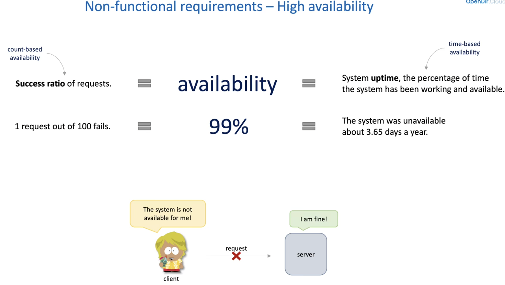
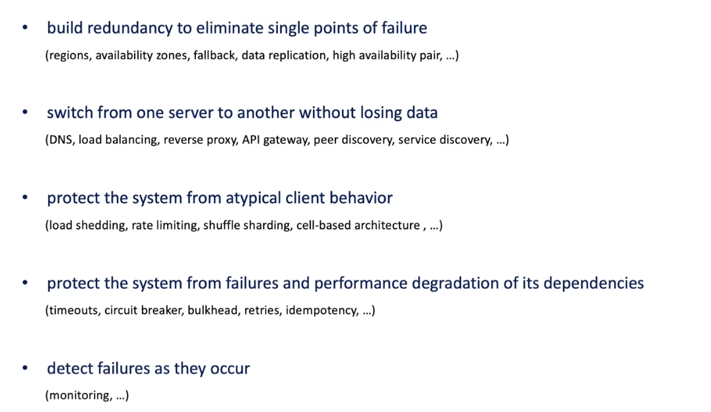
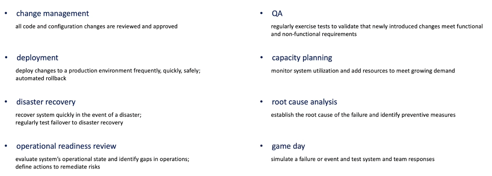
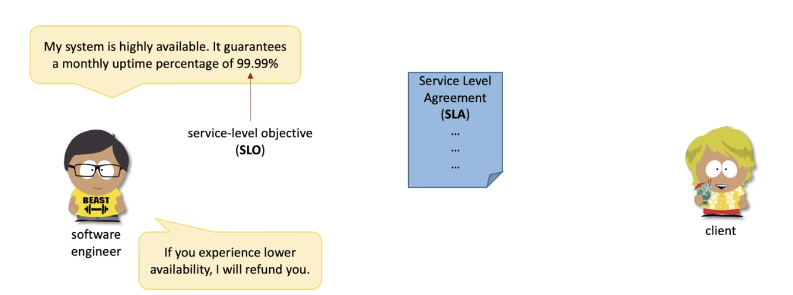

# High Availability
------------------
1. It is always client/ customer perceptive
   1. The System should be accessible irrespective at any given time
    
2. We need to make a system is highly available while software upgrades and patches, etc.
3. Design Principles behind 
    
   
4. 
   