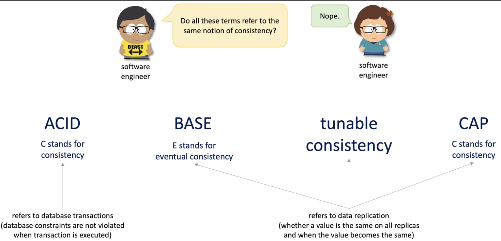
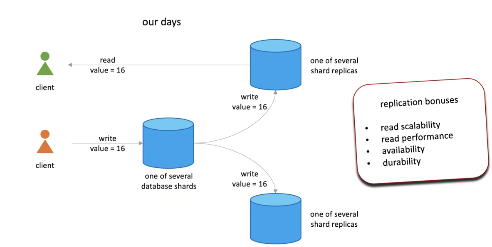
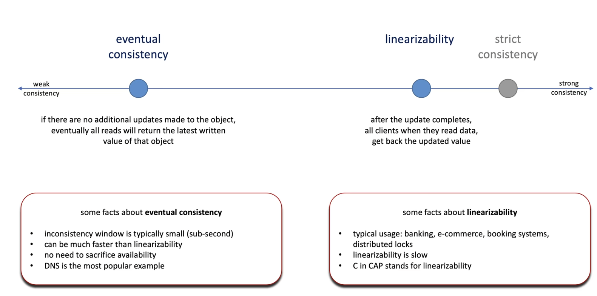
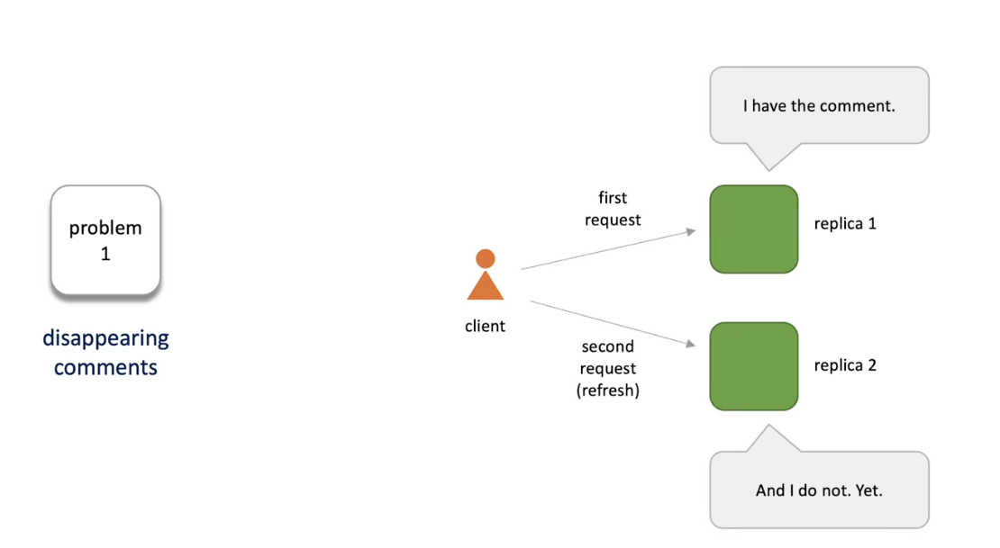
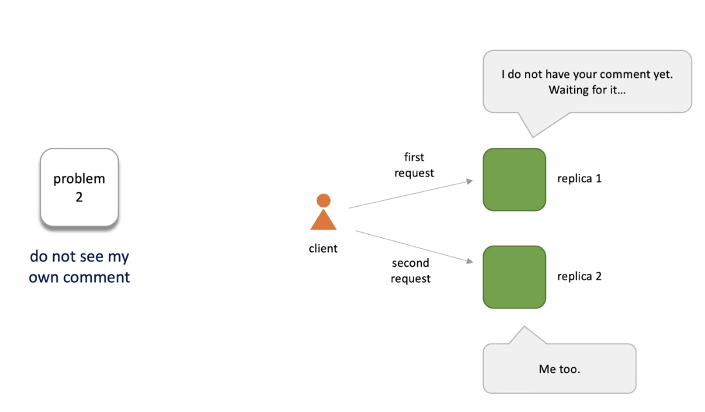
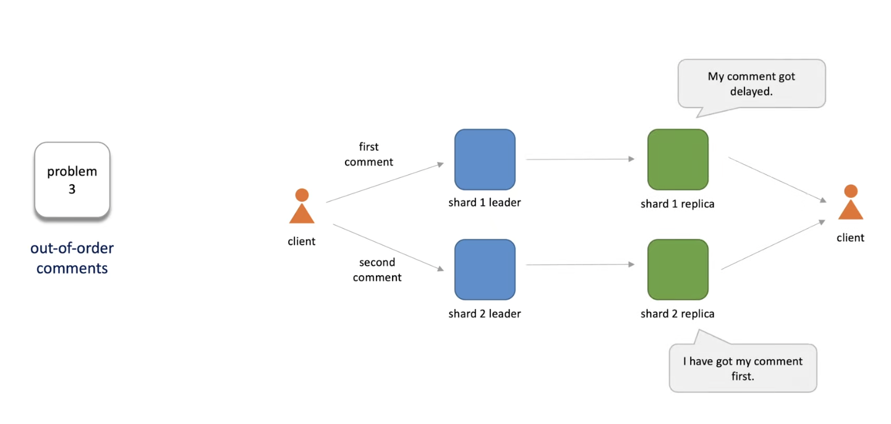
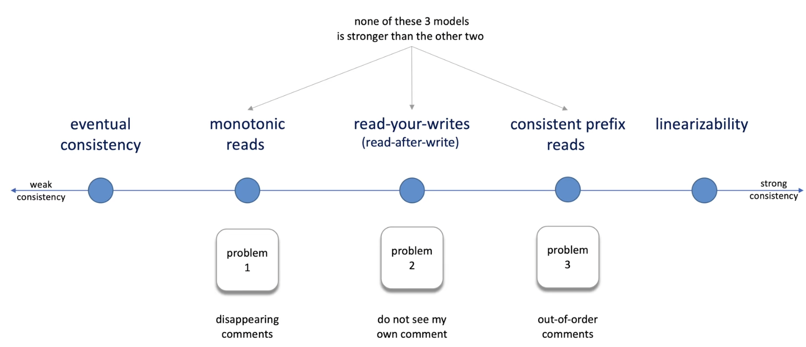

# Consistency

Intro
----
1. Consistency meaning changes 
    
2. Replica to address to some problems
    
2. Types of Consistency
   1. Strong Consistency
      1. The system always returns a single (most recent) value to clients.
   2. Weak Consistency - Eventual Consistency
      1. The system may return several different values (old and new) to clients.
3. Levels of Consistency
    
4. Problems with Eventual Consistency
    1. Exmaple - Blog comments
    
   
   
5. Solutions
   