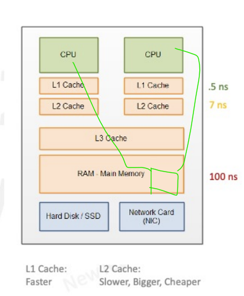
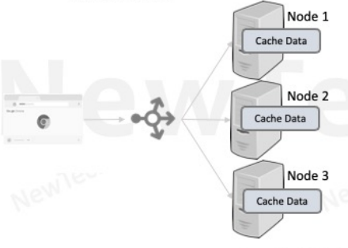
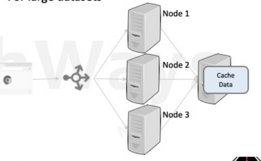

# Performance

# Latency in Software Systems

## 1. Latency in Serial Processes

### 1.1. Serial Request Latency

#### 1.1.1. Network Latency

- **Protocols are decided based on intra or internet clients.**
    - **Connection Latency** - Connections are costly
        - **Intranet**: Reuse the connections by using a connection pool.
        - **Internet**: Latest protocols come with persistent connection (e.g., HTTP/1.2).
    - **Data Transfer Latency**
        - Use Caching.
        - Use better data encoding format if interoperability is not an issue.
        - Compress the data.

#### 1.1.2. Memory Latency

- **Avoid memory bloats** - Minimize the code base size.
- **Garbage Collection**
    - Avoid using too much heap space, as it will slow down the garbage collection algorithm.
    - Encourage the usage of weak or soft references.
    - Wisely choose the Garbage Collection algorithm based on requirements.
- **Finite Buffer Memory**
    - Use normalization to reduce duplication so that the data stored in memory is decreased.
    - Prefer compute over storage - don't store the data that is computable.

#### 1.1.3. Disk Latency

- **Logging**
    - Log in batches instead of single logs.
    - Encourage Async logging if the order of logs is not important.
    - Delegate logging to a different thread.
- **Web Content**
    - Cache static content - Store static content in reverse proxy.
- **Database**
    - Write efficient queries.
    - Use appropriate schema normalization or denormalization.
    - Utilize indexing effectively.
    - Write better queries.
    - Consider using better hardware.

#### 1.1.4. CPU Latency

- Write efficient algorithms.
- Avoid context switching due to I/O bounds.
- Batch commits for I/O.
- Use Async processing.
- Use a single-thread model, delegate I/O to a different thread.
- Mindfully create thread pool size to avoid context switching.

## 2. Latency in Concurrent Processes

### 2.1. Concurrency of the application depends upon the percentage of serial processing in between.

### 2.2. Decrease Queuing and Coherence

#### 2.2.1. Contention/Queuing: Due to serial code

- **Coherence:** Due to the refreshment of common code between the thread or process.

#### 2.2.2. Places Where Contention Happens - Where Finite Resources are Possible

1. Creating connections—Connection Pool.
2. Thread pool.
3. Web server request  listen and accept queue.
4. Disk, memory, network.
5. Locks.

#### 2.2.3. Overcoming Contention

- **Choose the right size for listen, accept queue, connection pool, and thread pool.**
    - Decide thread pool size based on:
        - Wait time.
        - CPU time.
- **Vertical Scaling** - Increase system resources for disk, CPU, network resources.

#### 2.2.4. Overcoming Locks Contention
- Keep the minimum possible code inside synchronization.
- Use lock splitting and lock striping techniques
- Use read-write locks.
- Use atomic operations where possible.
- Use Compare and Swap in low contention cases
- [Detail Explinaton](https://github.com/raghunathreddymustur/HighLevelSystemDesign/blob/735399a89473d7f14b19b29b8cedea4683e53d69/DevToArch/concurrrency/readme.md)

# Deadlocks

## Lock Ordering Related
- Result of threads trying to acquire multiple locks
- Simultaneous money transfer from X and Y accounts by thread T1 and T2
    - T1: from X to Y
    - T2: from Y to X
- Acquire locks in a fixed global order
- Acquire locks only in the sort order of account numbers: X and then Y

## Request Load Related
- Threads waiting for connections to multiple databases
    - May run out of enough connections resulting in deadlocks
- Threads waiting for other threads to be spawned and perform some work
    - May run out of enough threads resulting in deadlocks

# Coherence Delays
Coherence delays in concurrency refer to the time it takes for changes made by one thread to a shared variable to become visible to other threads. This is crucial in multi-threaded programming to ensure that all threads have a consistent view of the shared data

## Visibility Guarantees
- **Java (volatile)**
    - A variable that a volatile read is always read from main memory and written back to main memory when updated in a processor

## Locking (synchronized)
- All variables accessed inside a sync block are synchronized at the start of the sync block
- All variables modified in the sync block are flushed to the main memory when the associated thread exits the sync block
- Synchronization ensures locking & visibility.

## Coherency Barriers
- These guarantees are provided by coherency barriers which may result in invalidating or flushing of caches

# Choosing Between `volatile` and Locking Mechanisms (`synchronized`)

## When to Use `volatile`
1. **Simple Flags**: Use `volatile` for simple flags or state variables that are read and written by multiple threads but do not require complex operations.
2. **Single Variable Updates**: When you need to ensure visibility of changes to a single variable across threads without needing atomicity for compound actions.
3. **Performance Considerations**: `volatile` can be more performant than locking because it avoids the overhead of acquiring and releasing locks.

## When to Use Locking (`synchronized`)
1. **Compound Actions**: When you need to perform compound actions atomically, such as incrementing a counter or updating multiple variables together.
2. **Complex State Management**: When managing complex state that involves multiple variables or requires ensuring that a series of operations are performed atomically.
3. **Thread Safety**: When you need to ensure that only one thread can execute a block of code at a time, preventing race conditions.

# Caching
## HTTP Static Data Caching - Places where data can be cached 

1. Services 
   1. Object Cache: cache not user-specific data
2. Web Server
    1. Session Cache: cache related to specific user sessions
3. Proxy Servers
   1. public static content: entry point to our services
4. Reverse Proxy or Load Balancers
    1. Static Contents: web static content
5. Client Browser:
   1. any images frequently asked

## How does client knows to cache particular data

- Server lets the clients know whether to cache particular data through headers

- **GET method responses** are idempotent and hence good candidates for caching.

## Headers

### Cache-control:
Determine if a resource can be cached.
- `No-cache`: Do not use the cache without validating with the origin server.
- `Must-revalidate`: Similar to no-cache, but clients may only use after re-validation, even if they are ready to accept stale data.

### Age:
Represents the age of the resource in the cache; instructs not to store data that has not been cached at all.

### Public vs. Private Caching:
- `Public`: Any shared cache can store the resource.
- `Private`: Only a client's personal cache can store the resource.

### Max-age:
Specifies the maximum age of a resource in the cache, relative to when it was requested.

## ETAG:
A hash code used for indicating different versions of a resource which helps invalidate previous versions stored in caches.

# Caching Dynamic Data

## Exclusive Cache
- Has low latency
- Without routing can lead to duplication
  - Useful for smaller datasets
- With routing can lead to uneven load balancing

## Shared Cache
- Higher latency due to an extra hop
- Can scale out to a distributed cache
    - Memcache
    - Redis
- For large datasets

# Caching Challenges

## Limited cache space results in early evictions
- Prefer caching for frequently accessed objects
    - Slow fast-moving consumer goods vs caching enough goods
- Average size of cached objects should be as small as possible to reduce getting full too soon causing evictions

**Cache Hit Ratio = # of cache hits / # of cache misses**

## Cache Invalidation & Cache Consistency
- Requires Update/Deletion of cached value upon an inconsistency
    - Not an option when a cache is outside of a system
- TTL data can be used to remove aged data
    - High TTL results in more cache hits but increases inconsistency intervals
    - Low TTL decreases inconsistency interval but also decreases cache hits 
# Summary

- **Performance Problems** are a result of Latency/Throughput Building up in a System
    - Watch out tail latency for hidden problems or future problems
- **Improving Network**
    - Reduce request response time of serial requests by improving resource utilization
- **CPU Load, Memory, Disk**
    - Improve throughput fetching frequently read data from disk or network
- **Caching**
    - Minimize concurrency of concurrent requests/jobs
    - Improve request/job serialization
- **Concurrency Control Techniques**
    - Read-modify-write cycles, lock splitting, and CAS
    - Prefer optimistic locking over pessimistic locking when contention is low
    - Reduce lock contention by reducing lock granularity, lock stripping, lock splitting
    - Promote elimination of deadlocks when using pessimistic locking

   

