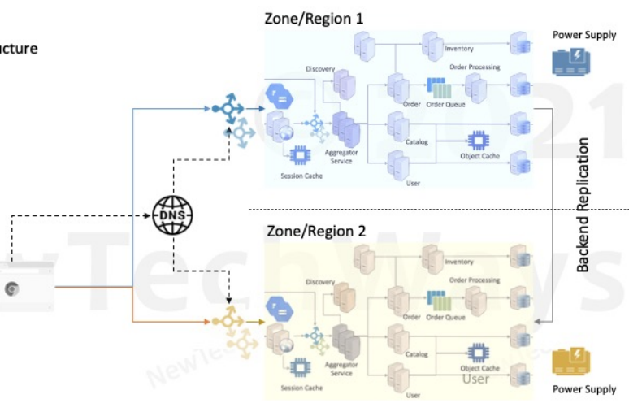
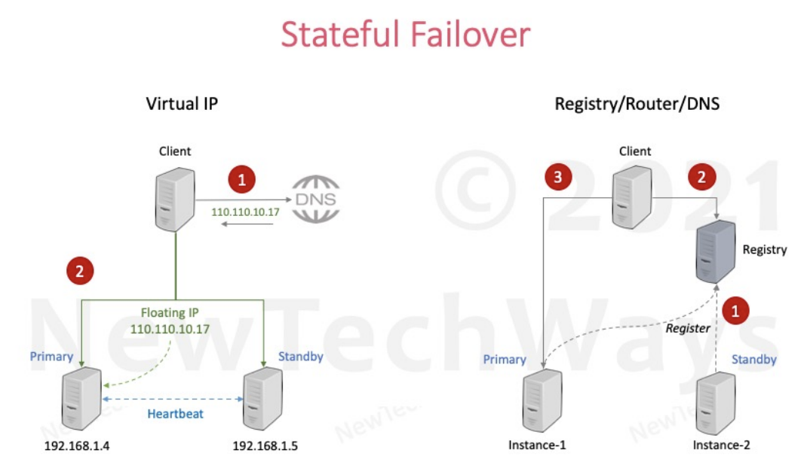

# Reliability 

# Large Scale Systems

## Overview
Large scale systems are typically distributed systems characterized by a vast number of components and component instances. These systems face unique challenges, particularly in terms of reliability and failure management.

## Characteristics

- **Distributed Systems**: Large scale systems are generally distributed, meaning they operate across multiple nodes or locations.
- **Components**:
    - **Large Number of Components**: These systems consist of numerous components.
    - **Component Instances**: There are many instances of each component.

## Failure Types

- **Partial Failures**: Failures can occur in parts of the system without affecting the entire system.
- **Independent Failures**: Failures can happen independently across different parts of the system.
- **Single Points of Failure**: Some components may be critical, and their failure can impact the entire system.

## Failure Characteristics

- **Increased Chance of Partial Failures**: The complexity and scale of these systems increase the likelihood of partial failures.
- **Impact of Partial Failures**: Partial failures can escalate and potentially lead to complete system failures.

## Partial Failures

- **Network Failure**: Issues with LAN, WAN, or Load Balancers.
- **Machine Failure**: Failures in CPU, Disk, or Memory.
- **Software Failure**: Process-related failures.
- **Disaster**: Failures at the Datacenter level.
- **Operations**:
    - **Configuration Failure**: Errors in system configuration.
    - **By Humans**: Human errors during operations.
    - **External Service Failure**: Failures in external services.

## Recovery vs. Prevention

- **Economical Recovery**: After a certain point, it becomes more economical to recover from failures rather than trying to prevent them altogether.
- No matter how hard we try
- Hardware and Networks will fail
- A changing Software will fail
- Disasters will happen

## Reliability Engineering

- Availability
- Reliability
- Fault Tolerance

# Reliability

- A system is said to be reliable if it can continue to function correctly and remain available for operations even in the presence of partial failures.
- It is measured as the probability of a system working correctly in a given time interval.

# Availability

- It is the probability of a system working correctly at any given time and being available for operations.
- Time based availability: availability = uptime/uptime+downtime
- Request based availability: successful requests/ (failure + successful requests)
- There can be downtime but the system is expected to recover from the same in a quick time.

- Availability requirements should come from the impact of availability on a business.
- Beyond business, availability is at the cost of:
    - New features
    - Operational costs
- The system should use downtimes permitted by SLA/SLO for rollout of new features.
- New feature rollouts invariably cause disruptions.

# Fault Tolerance

- Fault Tolerance is a technique to improve Availability and/or Reliability of a system.
- It is commonly referred to as an ability of a system to automatically:
    - Detect partial failures
    - Handle partial failures
    - Recover from partial failures
- Serviceability:
    - The ease with which a system can be serviced in the event of a failure also determines the availability of a system.

# Designing Fault Tolerance

# Redundancy

- Replication/Duplication of critical components or functions of a system in order to increase its reliability.
- A secondary capacity is kept ready as a backup, over and above the primary capacity, in case the primary is not available.

# Types of Redundancy

- Active Redundancy - Hot Spare:
    - All nodes do the processing.
    - Ideal for providing highest availability.
- Passive Redundancy - Warm Spare:
    - Only active nodes do the processing.
    - Ideal for quick recovery.
- Cold Redundancy - Spare (Backup):
    - Spare nodes are brought up only on a failover.
    - It is not a high availability option.

# Stateful vs Stateless

- Redundancy should be added upon scalability requirements
- Stateless is easy
  - same as scalability - add duplicate nodes
- Stateful
  - Databases
    - Master - Slave Replica
      - Only master duplicate not read replica
      - Catch of slave with master
        - Sync
        - Async
  - Message Queue
    - same as databases
  - Static content on reverse proxy
    - duplicate in nodes
  - Cache
    - Is it really required?
    - only reason to have cache duplicates 
      - if cache go down, request hits the database, degrading the peformance
  - Infra
    - Load Balancers
    - Power Supply
      - having multiple data centers
    - Data center
# Data Center Redundancy

# Fault Isolation

- Independent infrastructure

# Zonal Redundancy

- High Availability
- Active-Active Setup

# Regional Redundancy

- Disaster Recovery
- Active-Passive Setup

# Fault Detection

# Fault Models

1. Response Failure
    - A server fails to receive or respond to incoming messages

2. Timeout Failure
    - A server response duration is longer than timeout duration

3. Incorrect Response Failure
    - A server's response is incorrect

4. Crash Failure
    - A server halts but is working correctly until it halts

5. Arbitrary Response Failure
    - A server's response is incorrect because its security is compromised

# Health Checks

- External Monitoring Service
    - Ping based
- Internal Cluster Monitoring
    - Heart-beat based
# External Monitoring Service

- Health check service generates:
    - Alerts - for recovery
    - Events - for scaling
- Application Health Checks:
    - HTTP Response
    - TCP Response
- Periodic Health Checks:
    - Response Code
    - Response Time
    - Number of Retries
    - Up/Down
# Internal Cluster Monitoring

- Periodic exchange of heartbeats between redundancy cluster nodes
    - Requires protocols for communication and recovery
- Useful for stateful cluster components
    - Examples are NoSQL DB cluster and Load Balancers

# Recovery

# Stateless Recovery

- Can use existing scalability mechanism for recovery
- Hot standby:
    - Have active redundant instances up and running
- Warm standby:
    - Bring up new instances as and when needed
    - Terminate unhealthy instances if not dead already
    - Launch a new instance
# Stateful Recovery

# Load Balancer

# Database Recovery

## Hot Standby

## Warm Standby

## Cold Standby

## Summary of Availability

# Failover Best Practices

- Failover Automation
- Regular Failover Testing in Production

# Client Stability
# Timeouts

- Client Components:
    - User interface
    - Service clients
- Timeouts prevent calls to integration points from becoming blocked threads
    - Averts cascading failures

# Retry
- Client Transients:
    - Not for permanent failures
- For system errors
- Not for application errors
- Retries with exponential back-off
- Return HTTP 503 if and when to callback again
- Use Idempotent Tokens:
    - At least once guaranteed instead of exactly once

# Circuit Breaker

# Server Stability
# Fail Fast & Shed Load

## Server Components

## Fail Fast
- Triggered due to component's inability to process any request
- Validation error
- Missing Parameters/Env Vars
- Service Timeouts (When Circuit Breaker is open)
- Return error as soon as a component discovers it

## Shed Load
- Failing fast due to external load on a system as a result of which excess requests cannot be processed
- Concurrency Limits - Threads, Connections, Request Count
- SLAs - If SLAs are not met, block/reject incoming requests

## Back Pressure
- Shedding load for slowing down clients within a system boundary

# Summary

## Highly Available & Highly Reliable Systems
- Fault-Tolerant by design
- Fault tolerance is achieved by:
    - Provisioning redundancy for every SPOF
        - Hot/Active, Warm/Passive, Cold/Backups
        - Stateless redundancy & Stateful redundancy
    - Building automated mechanisms to detect faults
    - Building automated failover mechanisms to recover from faults
    - Failover of stateless components
    - Failover of stateful components

## Stability Patterns
- Clients:
    - Timeouts
    - Retries
    - Circuit Breaker
- Server:
    - Fail Fast
    - Shed Load
    - Back-pressure

