# Scalability

# Performance Vs Scalability

- **Performance**
    - **FIXED LOAD**
        - Low Latency
        - High Throughput
            - Single Machine – Multi-Threading 
            - Multiple Machines - Multi-Threading + Multi-Processing – Distributed Processing
        - Capacity

- **Scalability**
    - **VARIABLE LOAD**
        - High Throughput
          - Ability of a system to increase its throughput by adding more hardware capacity
          - Both upwards and downwards
# Vertical & Horizontal Scalability

- **Vertical**
    - Easier to achieve
    - Limited scalability

- **Horizontal**
    - Hard to achieve
    - Unlimited scalability

# Ways to Achieve Horizontal Scalability

## Reverse Proxy

- Client needs to know only about the address of the Reverse Proxy
- Reverse Proxy can also act as a load balancer

# Scalability Principle

- Decentralization - Monolith is an anti-pattern for Scalability
    - More workers - Instances, Threads
    - Specialized workers - Services
- Independence
    - Multiple workers are as good as a single worker if they can't work independently. They must work concurrently to the maximum extent.
    - Independence is impeded by:
        - Shared resources
        - Shared mutable data
# Modularity

- Scalable architecture starts with modularity
- Provides the foundation for breaking an application into more specialized functions/services
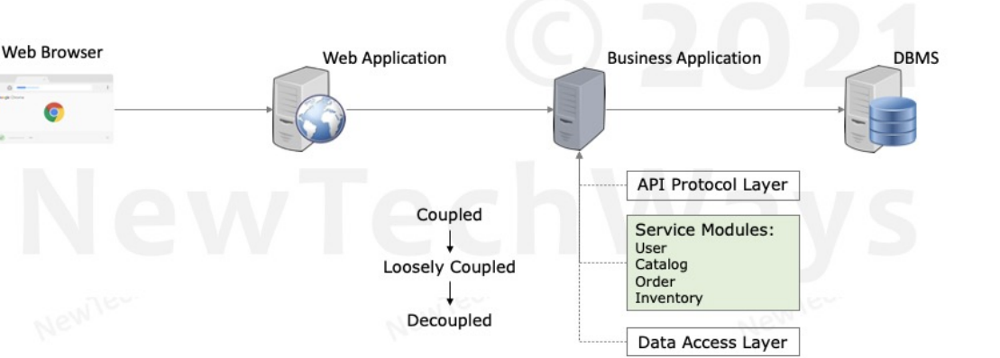

# Replication

- For handling increasing workloads
- Stateless
    - Code Replication
- Stateful
    - Code & Data Replication
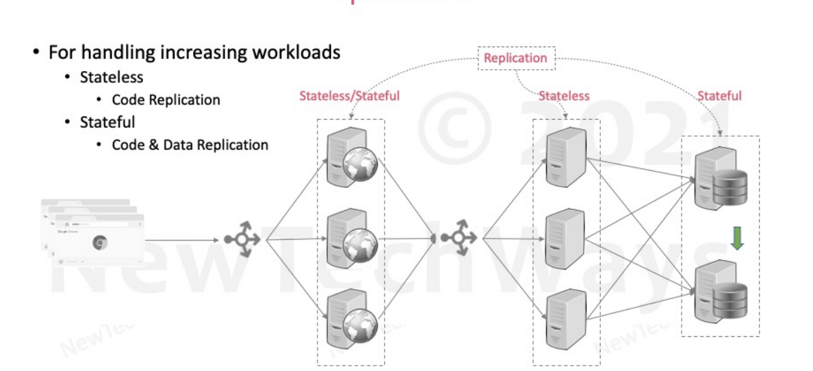

# Web Server Stateful Replication

## When low latency is required
- Sticky sessions/Session affinity
  - Cache the info in processed node
  - Route same user to the node that has processed this request before
- Sessions occupy memory
  - This causes the memory fillup in nodes
- Session clustering for high availability
  - wt if that node goes down - data is lost in between if chace is not sync with database
  - to overcome have to implement strategies that help in replication of cache data in all nodes
- Minimize caching stateful data as much as possible
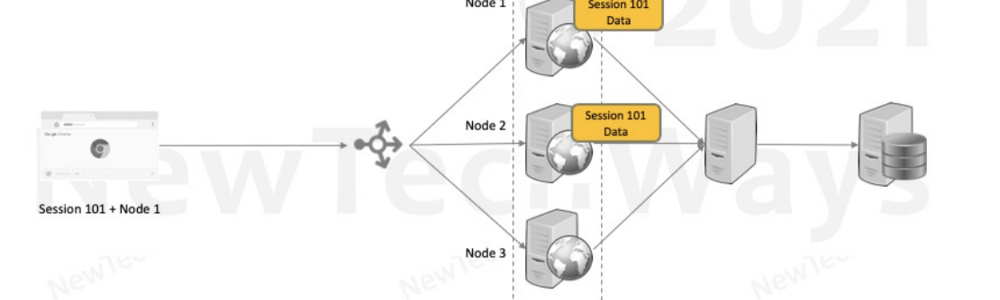

# Web server Stateless Replication

## For higher scalability at the expense of higher latency
- Session data can be stored on:
    - Client Side in Cookies
    - Server Side in Shared Cache
    - 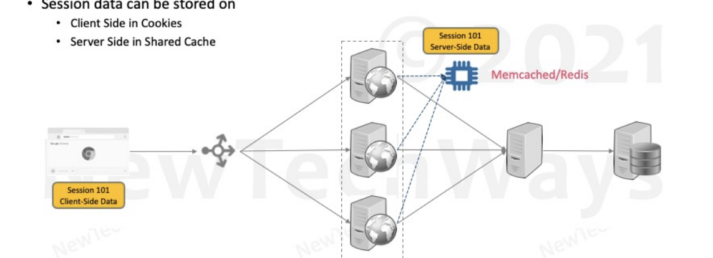
# state vs stateless
- Go to stateful whenever latency is very critical 
- stateless if a bit of latency is okay

# Web Services Replication

1. Same as web servers
2. services mostly are stateless
3. When multiple nodes are accessing a shared resources, then lock is maintained at database level
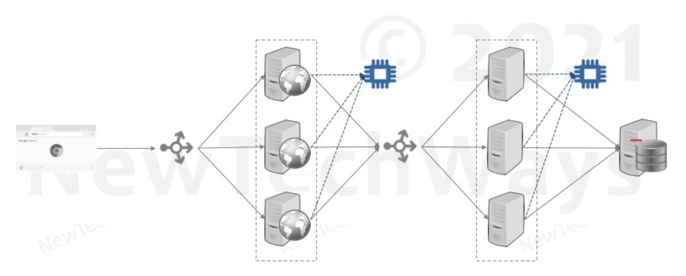

# Database Replication
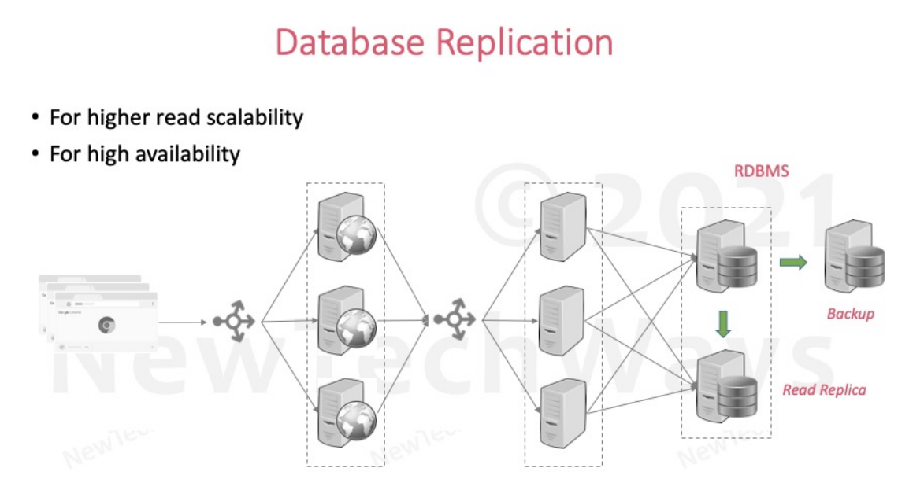
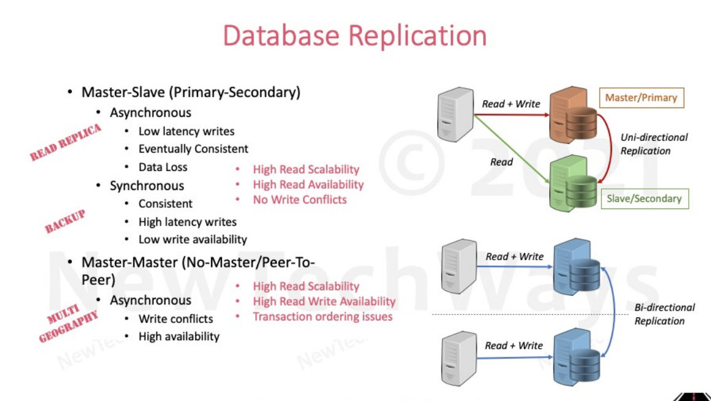

# Specialized Services (SOAP/REST-Services)

## Characteristics
- Partially independent development and deployment
- Independent scalability
- Independent technology
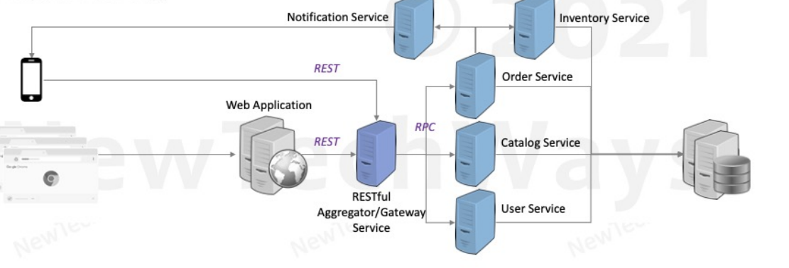

# Asynchronous Services - increase scalability at peak load

## Characteristics
- Async services effectively` **reduce write load**` from a database
- Send Acknowledgement and process it in Async
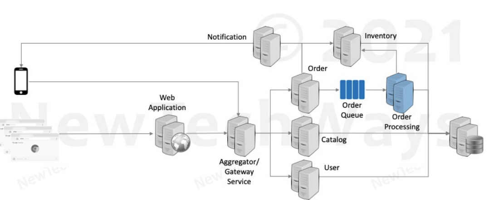
- Nullify peak load via Queue
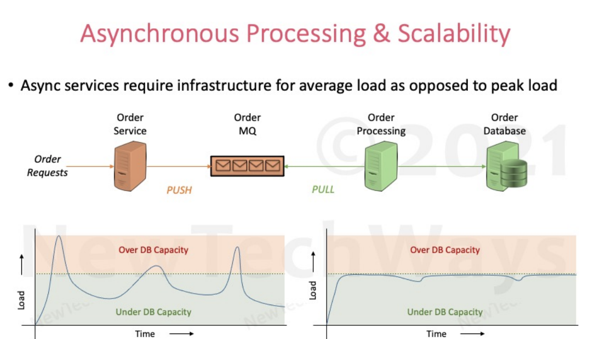

# Caching

## Characteristics
- Caching reduces latency and `reduces overall read load`

# Database Vertical Partitioning (Micro-Services)

## Characteristics
- Micro-Services completely decouple services and databases for higher scalability
- Can no longer do inter-service ACID transactions and need to deal with eventual consistency
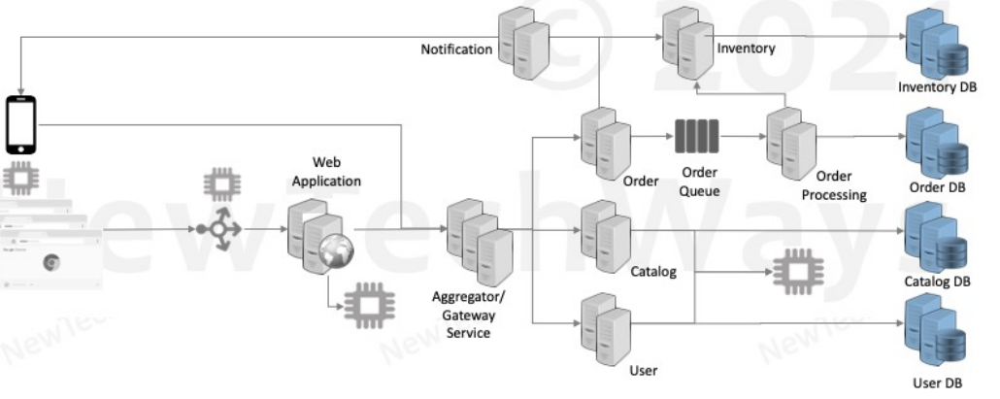

# Database Horizontal Partitioning (Micro-Services)
- Rang Partition
- Hash Partition
  - Consistent Hashing
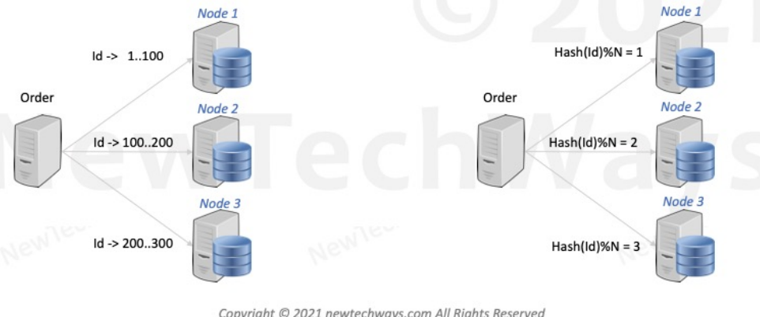
# Database Partitioning Selection - type of quiries

## Range Partitioning
- Example Queries:
    - `SELECT * FROM Order WHERE id = 150`
    - `SELECT * FROM Order WHERE id > 150 AND id < 250`

## Hash Partitioning
- Example Query:
    - `SELECT * FROM Order WHERE id = 150`

## Routing - Client -  nodes communicate with each other
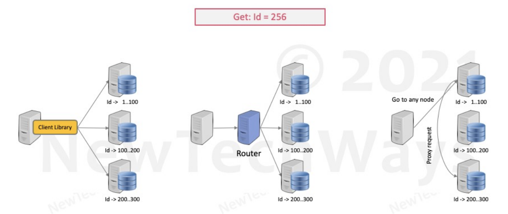

## Horizontal Scaling Methods

## Methods
1. Services
2. Replication
    - Stateful
    - Stateless
3. Partitioning
    - Vertical/Functionality Partitioning
    - Database Partitioning
4. Asynchronous Calls
5. Caching

# Load Balancing
1. Single IP for each Component
2. Load Balance at each service
    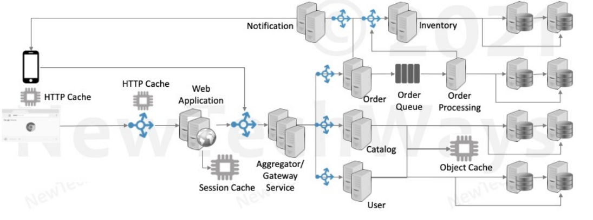
3. or use discovery service which will hold info of all nodes of each service (each nodes communicates about health to the discovery service)
    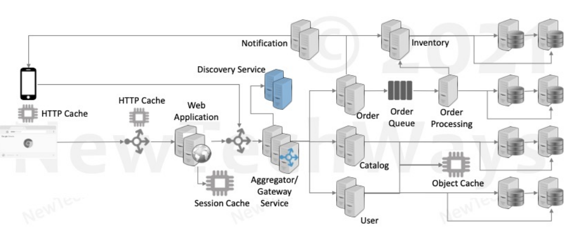

# Load Balancer Discovery

## Methods
- External Clients: Use DNS to discover the external load balancer
- Internal Clients: Use a local registry/config to discover an internal load balancer
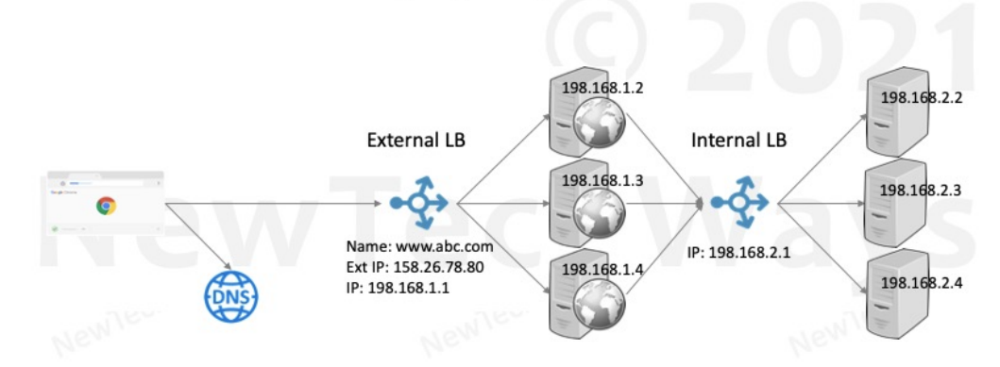

# Hardware vs Software Load Balances
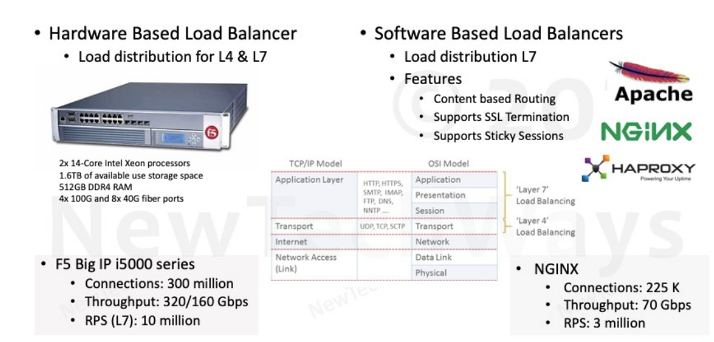

# Feature of L7 Load Balancer
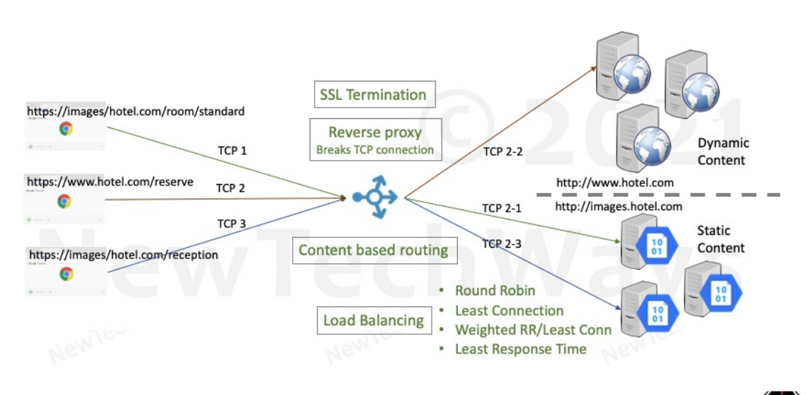

# DNS as Load Balancer

## Functions
- Configure DNS records with multiple A records
- Return single IP in a round-robin fashion
- Return a list of IPs
- Cloud-based DNS can be configured along with health checks

## Drawbacks
- Indefinite caching and not respecting TTLs
- Low or zero TTLs can create a very high load on DNS
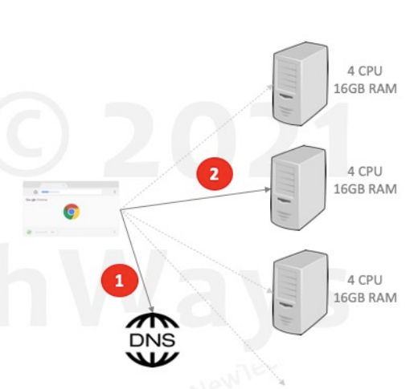

# Global DNS - MultiRegion

## Scalability
- Routing for multi-geographic systems

## Performance
- Locality for multi-geographic users
    - Client to Datacenter Latency
    - Client to Datacenter Proximity
    - Datacenter Geography

## High Availability
- Multi region availability

## Disaster Recovery
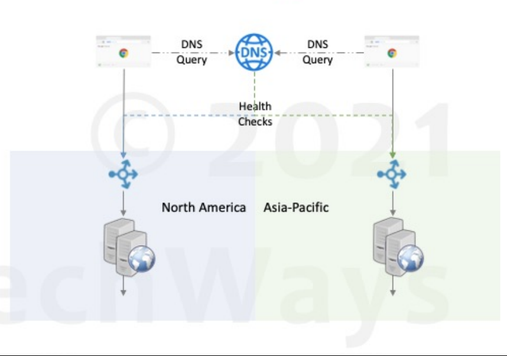

# Global Data Replication

## Active-Active Setup
- All sites active
- Master-Master or Peer-to-Peer replication
- Mostly asynchronous
- Failover is quick
- Some data loss is a possibility
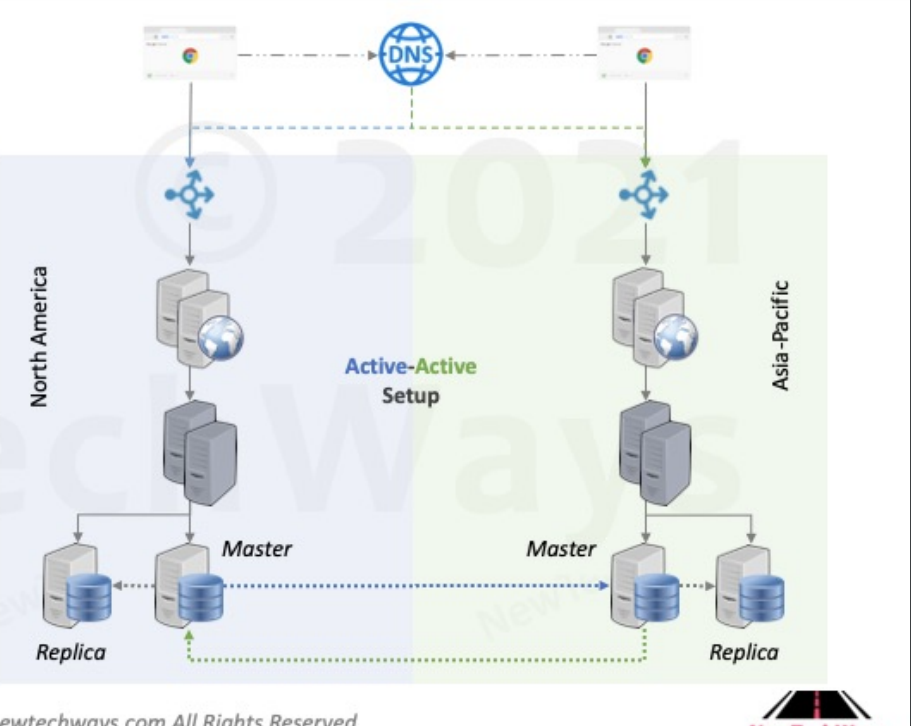

# Monitoring and Auto-Scaling Services

## Monitoring Service
- Monitor Load
    - CPU
    - Network
    - Disk
- Monitor Health
    - Ping
    - Http

## Auto-Scaling Service
- Configure load thresholds
- Monitor load
- Launch New Instance
- Shutdown Instance
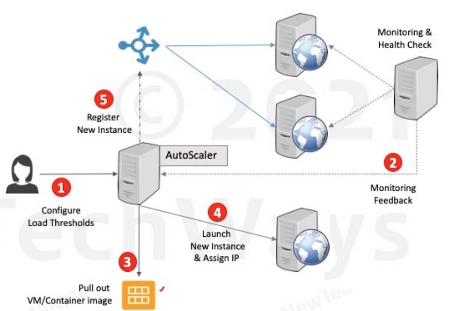

# Microservices Architecture

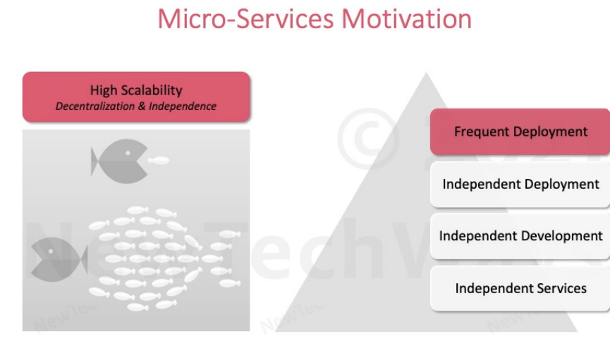

# Service Oriented Architecture

## Independent
- Each service can have its own technology stack, libraries, frameworks, etc.
- Each service can be scaled independently and differently

## Not Independent
- Common interface schema 
  - XML schema
- Common database schema
  - RDBMS schema

## Issues
- Service development may be independent but not deployment
- Single database has scalability limitations
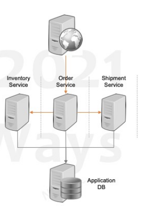

# Microservices Architecture overcomes above issues

- Shared Nothing Architecture
  - Services developed and deployed independently
  - Achieved through vertical partitioning
- Vertical/Domain Partitioning
  - Independent schema/database
  - Loosely coupled service interfaces
    - REST interfaces instead of XML/WSDL schemas
- No reusable libraries except utilities

## Issues
- Duplicate Codebase
- Transaction failures
- Transaction rollbacks
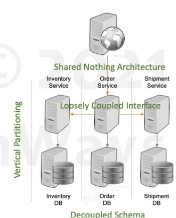

# Transaction Involves Multiple Machines

## Characteristics
- Distributed services with their own DB
- Local transaction not possible

## Options
- Distributed ACID Transactions
    - 2PC/3PC
    - Completely ACID
- Compensating Transactions
    - SAGA pattern
    - Eventually consistent model
    - Relaxes consistency and isolation
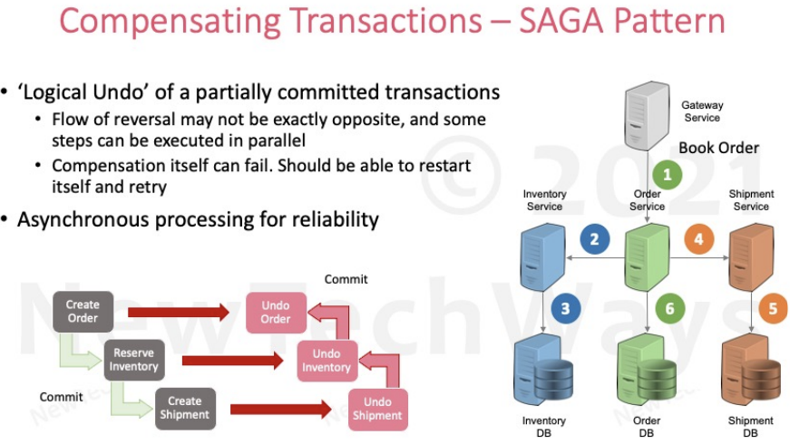

# Micro services Communication - Processing Types

## Synchronous Processing
- Immediate Response
- For read/query loads

## Asynchronous Processing
- Deferred response
- For write/transaction loads
- Higher scalability
- Higher reliability

# Microservice Event Driven Transactions

## Happy Path
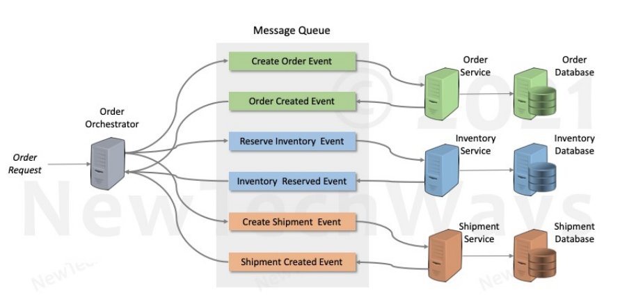

## Un Happy Path
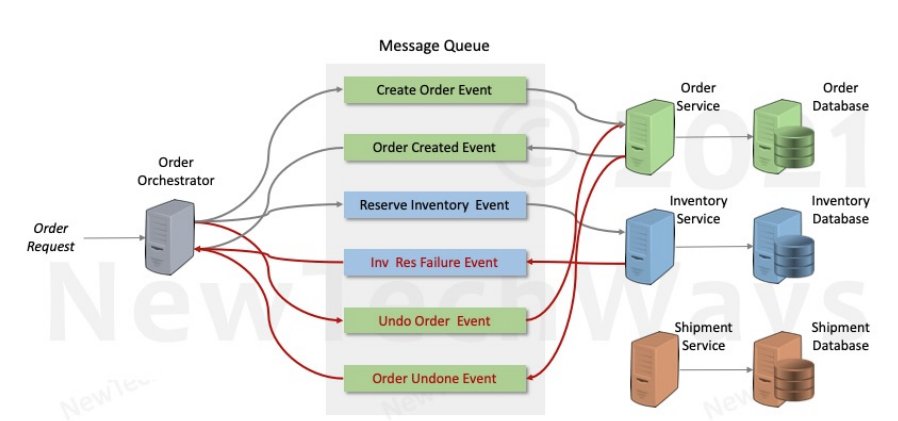

# Achieving High Scalability with NO SQL and Kafka

## Characteristics
- ACID within Service
- Compensating Transaction across services
- Eventually consistent

## NoSQL DB
- ACID transaction at aggregate level
- Eventually consistent transactions across aggregates
- Low latency operations
- Multiple nodes
- High scalability
- Horizontal partitioning

## Kafka
- Horizontal partitioning of topics

# Summary

-  Scalable Systems,  Decentralized components functioning independently

## Strategies for Scalability
- Cache frequently read and rarely mutating data to reduce load on the backend
- Asynchronous or Event-driven processing for distributing load over time
- Vertical partitioning of functionality into independent, stateless, replicated services
- Partitioning and replication of state for extreme scalability

## Required Infrastructure
- Load balancers: Hardware-based (L4 + L7) & Software-based (L7)
- Discovery services for service discovery and health checks
- DNS as load balancers at global scale

## Microservices for extreme scalability
  - Fully vertically partitioned services and databases leading to eventual consistency

