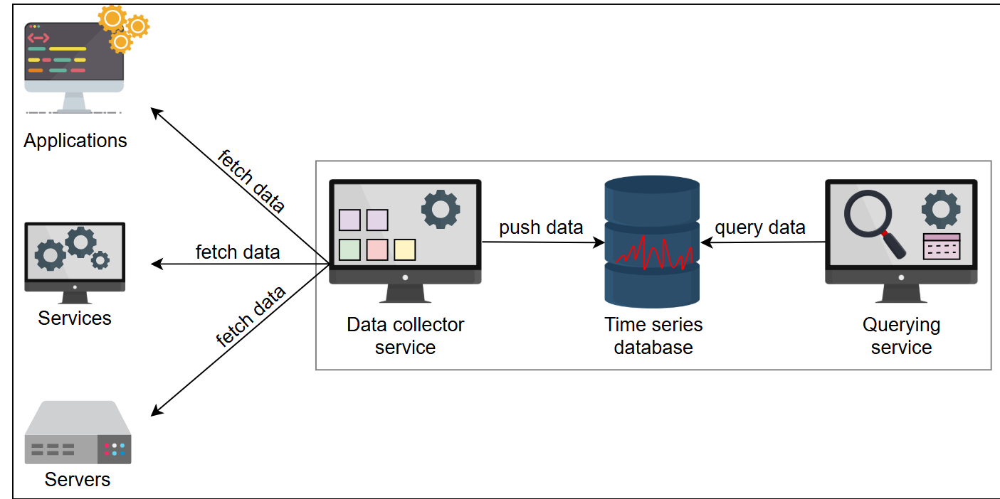
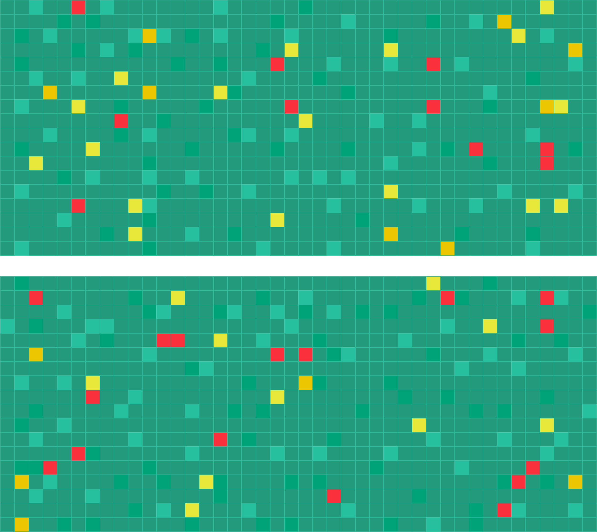

# Distributed Monitoring

## 📡 System Design: Distributed Monitoring
Learn about the **importance of monitoring** in a distributed system and explore our **high-level plan** for designing it.

### 🔍 Monitoring
The modern economy depends on the **continual operation** of IT infrastructure, which includes **hardware, distributed services, and network resources**. These components are interlinked, making it **challenging to ensure smooth functioning** without application downtime.

In distributed infrastructure, it can be difficult to know **what's happening at the hardware or application level**. Failures may arise due to **response latency overshoot, overloaded hardware, or containers running out of resources**. Since **multiple services** run in such environments, **a failure in one service** can lead to **cascading failures**, ultimately making the application **unavailable to users**.

If we don't detect failures **early**, debugging the system **manually** can be **time-consuming and expensive**. Additionally, for larger services, ensuring **adherence to service-level agreements (SLAs)** is crucial. Catching **trends and signals** indicating **impending failures** enables proactive intervention.

Monitoring helps in **analyzing complex infrastructure**, where **something is constantly failing**. It entails **gathering, interpreting, and displaying data** about interactions between simultaneously running processes. This assists in **debugging, testing, performance evaluation**, and gaining a **bird’s-eye view** of multiple services.

### 🛠️ How will we design a distributed monitoring system?
We've divided the **distributed monitoring system design** into several **chapters and lessons**:

#### 📊 Distributed Monitoring
- **Introduction to Distributed Monitoring**: Understand **why monitoring is crucial** in distributed systems, how **downtime can be costly**, and different **types of monitoring**.
- **Prerequisites for a Monitoring System**: Explore **essential concepts** such as **metrics and alerting** in monitoring systems.

#### 🖥️ Monitoring Server-side Errors
- **Designing a Monitoring System**: Define the **requirements and high-level design** of the monitoring system.
- **A Detailed Design of the Monitoring System**: Dive into the **components involved** in monitoring system design.
- **Visualizing Data in a Monitoring System**: Learn **effective ways** to visualize **large amounts of monitoring data**.

#### 🏷️ Monitor Client-side Errors
- **Focus on Client-side Errors**: Discover **the significance of monitoring client-side errors**.
- **Designing a Client-side Monitoring System**: Learn how to **create a system** to track and manage **client-side errors**.

---

## 📡 Introduction to Distributed Monitoring
Learn **why monitoring is crucial** in a distributed system and how it helps prevent **cascading failures**.

### 🛑 Need for Monitoring
A failure in **one service** can disrupt related systems, potentially leading to a **cascade of errors**. **Proactive monitoring** can help detect these issues before they snowball into larger problems.

Consider a **video upload scenario** on YouTube:
1. **UI service** takes video information and forwards it.
2. **Service 2** records the entry in a database and stores the file in **blob storage**.
3. **Service 3** manages replication between **databases X and Y**.
4. **Service 3 fails**, causing **database X to crash**.
5. The request is redirected to **database Y**, but **data is missing**.
6. The user attempts to play the video but gets an error: **"Video not found..."**.

Due to the **complexity of modern systems**, manual debugging becomes **impractical**. A robust monitoring system **reduces operational costs** and automates **failure detection**.

### 💰 Downtime Cost
Even **fault-tolerant designs** cannot entirely prevent failures. **Detecting issues early** is critical to avoid **major financial losses**.

For example:
- **Meta** experienced a **nine-hour outage** in **October 2021**, leading to a loss of **$13 million per hour**.
- **Amazon AWS** faced an outage on **December 7, 2021**, causing **persistent congestion** and network delays. The estimated **cost of downtime** was **$66,240 per minute**.

With **globally distributed data centers**, monitoring becomes even more important. Companies must ensure **continuous system performance** across different geographical locations.

### 📊 Types of Monitoring
Errors in distributed systems can be classified into **two broad categories**:

#### 🖥️ Server-side Errors
- These occur **on the server** and can be detected by **monitoring tools**.
- Usually logged as **HTTP 5xx errors**.
- Example: A failed connection request that reaches the server but **returns a timeout error**.

#### 📱 Client-side Errors
- These happen **on the client-side** and may not be visible to the server.
- Typically represented as **HTTP 4xx errors**.
- Example: A request **fails to reach the server**, and the client **gets an error message**.

### 🛠️ Monitoring System Design
A well-designed monitoring system helps in **detecting and resolving faults** across **globally distributed services**. It provides insights into **system health, resource utilization**, and **failure trends**.

---


## 📡 Prerequisites of a Monitoring System
Learn about **metrics and alerting** in a monitoring system, and understand how they ensure **service stability**.

### 🔍 Importance of Monitoring
A **good monitoring system** defines:
- **What metrics to measure**
- **Threshold values for alerts**
- **How to notify appropriate stakeholders** when values go out of range

Monitoring helps **support teams** analyze system health and **respond proactively** to potential failures. Without proper monitoring, debugging infrastructure issues becomes **costly and time-consuming**.

### 🛑 Handling Failures: Reactive vs. Proactive Approaches
There are **two conventional approaches** to handling IT failures:

1. **Reactive Approach:** Fix errors **after they occur**, leading to **undesirable downtime**.
2. **Proactive Approach:** Predict failures **before they happen**, preventing downtime and enhancing **system reliability**.

Since **failures are inevitable** in large-scale services, early detection is **key** to maintaining seamless user experiences.

### 📊 Metrics: Defining System Health
Metrics **objectively measure** various system parameters. Examples include:
- **Network performance** (throughput, latency)
- **Server capacity** (requests per second)
- **Resource consumption** (CPU usage, memory utilization)

Efficient monitoring **minimizes performance penalties** while providing valuable system insights.

### 🔄 Push vs. Pull Strategy for Metrics Collection
There are **two methods** for fetching metrics:
- **Pull Model:** Monitoring system fetches data **on demand** from application endpoints.
- **Push Model:** Servers periodically send metrics **to the monitoring system**.

Each strategy has advantages:
- **Pull model** prevents overload by **fetching data at its own pace**.
- **Push model** helps bypass **firewall restrictions** that block direct access.

### 📝 Logging for Monitoring
Logging records **events and system performance** data. Logs contain:
- **CPU usage details**
- **Application-specific metrics**
- **Error reports for debugging**

Logs **supplement monitoring systems**, providing historical context for **analyzing performance trends**.

### 🗄️ Storing Metrics: Time-Series Databases
Large-scale monitoring requires **efficient data storage**. A **time-series database** ensures:
- **Data durability**
- **Chronological event tracking**
- **Historical trend analysis**

Time-series databases store **metrics with timestamps**, helping visualize system behavior over time.

### 🛠️ Application Metrics & Code Instrumentation
To track **custom metrics**, applications must expose relevant data via:
- **Embedded logging**
- **Monitoring APIs**

This enables **automatic scaling** and **real-time failure detection** for dynamic systems.

### 🚨 Alerting: Responding to Failures
Alerts trigger **automated actions** when metric values cross **defined thresholds**. A well-designed alerting system includes:
- **Condition-based rules**
- **Notifications for critical failures**

---

## 📡 Design of a Monitoring System
Explore the **core requirements and components** of a **generic monitoring system** that ensures **service reliability**.

### 🛑 Requirements of a Monitoring System
A well-designed monitoring system should:
- **Track critical local processes** to detect crashes.
- **Identify anomalies** in CPU, memory, disk, and network usage.
- **Assess overall server health**, including bandwidth, load, and faults.
- **Monitor hardware failures**, such as slow disks or memory failures.
- **Check connectivity** with critical external services.
- **Supervise data center elements**, including network switches and power consumption.
- **Analyze network latency** within and across multiple data centers.
- **Ensure external accessibility**, monitoring DNS and routing status.
- **Evaluate global service health**, including CDNs and their performance.

To streamline **failure detection**, the system should provide automated alerts and dashboards for **quick response and debugging**.

### 🏗️ Building Blocks of Distributed Monitoring
The **high-level components** of a **distributed monitoring system** are:

#### 🗄️ Blob Storage
- Stores **metric information** for analysis.
- Ensures **scalability** in data collection.

#### 📝 Time-Series Database
- Keeps **structured records of system metrics**.
- Supports **trend analysis** and historical tracking.

#### 🔄 Data Collector Service
- Collects relevant data from monitored services.
- Pushes collected **metrics to storage**.

#### 🔍 Querying Service
- Provides an API interface for **metric retrieval**.
- Helps **visualize and analyze performance data**.

### 🎯 High-Level Design Overview
The system operates through **a series of interconnected components**:
1. **Applications push data** to the monitoring system.
2. **Servers collect relevant metrics** from various sources.
3. **Data collector service stores metrics** in a time-series database.
4. **Querying service retrieves insights** for dashboards and alerts.

This approach ensures **scalable, real-time monitoring** across multiple infrastructure layers.

---

## 📡 Detailed Design of a Monitoring System
Understand the core components of a **monitoring system**, its strengths, weaknesses, and strategies for improvement.

### 🗄️ Storage Architecture
To store and analyze metrics, we use **time-series databases** on the monitoring server and integrate **blob storage** to hold key data points.

We categorize stored metrics into two key areas:
- **System Performance Metrics**: Includes CPU, memory, and network usage.
- **Rules & Alerts Database**: Defines **thresholds for critical actions** (e.g., triggering alerts when CPU usage exceeds **90%**).

Upon **rule violation**, the system takes automated actions, such as **allocating more resources** to prevent downtime.

### 🔄 Data Collection Service
Our monitoring system **extracts metrics** from distributed applications using **logging**. We adopt a **pull-based approach**, allowing the monitoring service to **fetch relevant logs** rather than relying on applications to push data.

We use **distributed messaging queues** to store:
- **Service name**
- **Unique service ID**
- **Log description**

This helps **track services** efficiently and ensures **high availability**.

### 🔍 Service Discovery Mechanism
Rather than keeping **a predefined list of services**, the monitoring system discovers them dynamically using **EC2, Kubernetes, and Consul integrations**.

Service discovery enables monitoring of:
- **Newly added infrastructure components**
- **Commissioned hardware updates**
- **Cloud services and database clusters**

### 📊 Querying & Alert Mechanism
To **access stored metrics**, we require a **querying service** that retrieves relevant system health data and helps visualize failures.

#### 🚨 Alert Management System
The **alert manager** ensures violations trigger immediate notifications via:
- **Emails**
- **Slack messages**
- **Monitoring dashboards**

The dashboard **visualizes collected metrics**, helping administrators detect trends, failures, and bottlenecks.

### ⚖️ Strengths & Weaknesses of the Current Design
#### ✅ Pros
- **Efficient monitoring** prevents **service disruptions**.
- **Pull-based strategy avoids network congestion**.
- **Automated alerting ensures proactive intervention**.
- **High availability** improves fault tolerance.

#### ❌ Cons
- Scalability may become a **bottleneck** when monitoring **large numbers of servers**.
- The **monitoring server can become a single point of failure (SPOF)**.
- Managing **data retention** and deleting **unneeded logs** is challenging.

### 🔧 Improving the Design
To enhance **scalability**, we introduce a **hybrid pull-push model**:
1. **Local monitoring servers** collect data from applications.
2. **Secondary monitoring servers** push data to **primary data center servers**.
3. The **primary server** sends aggregated metrics to a **global monitoring service**.

Using **blob storage, elastic search**, and **hierarchical monitoring**, we ensure **continuous scalability**.

---

Here's an editable version of the README file with structured headings, meaningful icons, and **highlighted important sections**:

## 📊 Visualizing Data in a Monitoring System
Discover an **innovative approach** to visualizing **large-scale monitoring data** for distributed systems.

### 🔍 Why Visualization Matters
Large-scale data centers house **millions of servers**, making it **challenging to assess** their operational health at a glance. A vital aspect of **monitoring distributed services** is determining **which components are functioning** and **which have failed**.

To tackle this challenge, we employ **heat maps**, an effective way to visualize **server status** compactly.

### 🌡️ Using Heat Maps for Monitoring
A **heat map** is a **data visualization technique** that represents information using **color intensity**. This approach helps **quickly pinpoint** problem areas within a **data center, cluster, or row**.

Heat maps categorize servers based on their **operational state**:
- ✅ **Green cells**: Servers operating **within permitted parameters**.
- ❌ **Red cells**: Nonresponsive servers **after multiple attempts**.

Example heat map representation:

```
    Cluster 1   | 🟢🟢🟢🟢🟢🔴🟢🟢
    Cluster 2   | 🟢🟢🔴🟢🟢🟢🟢🔴
```

Clusters with **high failure rates** can be **quickly identified**, ensuring **efficient debugging**.

### 🌍 Monitoring Globally Distributed Systems
Heat maps are **scalable**, allowing monitoring across **global infrastructure** with minimal data usage:
- Each server is represented with **one bit** (1 for **active**, 0 for **offline**).
- For **1,000,000 servers**, only **125 KB of data** is required.

Using this approach, we **pinpoint problematic areas** efficiently, reducing **manual intervention**.

### 📡 Expanding Heat Map Usage
Beyond servers, heat maps can be adapted to monitor:
- **Filesystem health**
- **Networking switches and link integrity**
- **Data processing nodes**
- **Cloud-based resources**

By **aggregating health metrics visually**, administrators gain a **bird’s-eye view** of infrastructure performance.

### 📝 Summary
- **Heat maps provide an effective visualization method** for monitoring large data centers.
- They **help troubleshoot failures** by categorizing operational states.
- Using **minimal storage**, heat maps **track global service health efficiently**.
- Their flexibility allows **broad application** across distributed systems.

---

## 📡 Focus on Client-side Errors in a Monitoring System
Learn about **client-side errors**, their impact on service availability, and why they can be **challenging to detect**.

### 🔍 Understanding Client-side Errors
In a distributed system, clients interact with services through **HTTP requests**. Monitoring **server-side logs** provides insights into errors—especially when multiple requests fail, causing spikes in **internal errors (HTTP 500)**.

However, errors originating on the **client-side** pose a unique challenge because the service **has limited visibility** into the client’s environment.

### ⚠️ Challenges in Detecting Client-side Failures
Unlike server-side failures, where **spikes in HTTP 500 errors** are easily detectable, **client-side issues** require a different approach. Some common challenges include:
- **Failure in DNS name resolution**
- **Issues in routing between the client and service provider**
- **Failures in third-party infrastructure** (such as CDNs or middleboxes)

Due to variable load patterns, **traffic dips** may indicate client-side failures, but **false positives** and **false negatives** make detection unreliable.

### 🏷️ Server-side vs. Client-side Errors
#### 🖥️ Server-side Errors
- Logged on **web and application servers**.
- Often categorized as **HTTP 500 internal server errors**.
- **Easier to detect** using monitoring tools.

#### 📱 Client-side Errors
- Failures **before requests reach the server**.
- May originate from **routing issues, DNS failures, or third-party infrastructure**.
- **Harder to detect**, often requiring **behavioral analysis**.

### 🌎 Real-world Example: Routing Bug Impact
A notable example occurred when **Google’s peer ISP accidentally misconfigured** internet routes. As a result:
- **Customer traffic was incorrectly redirected**, preventing users from reaching Google.
- **Google was initially unaware** of the outage since **its own infrastructure remained operational**.
- The issue was traced to a **BGP route leak**, demonstrating how routing failures can disrupt connectivity **without affecting service-side health metrics**.

### 📊 Monitoring Client-side Failures
Client-side failures **aren’t uncommon**—similar **BGP leaks** have occurred multiple times. Another major routing leak happened on **April 16, 2021**, when an AS **announced over 30,000 incorrect BGP prefixes**, leading to a **13-fold spike** in inbound traffic.

Since traditional monitoring systems **often fail to capture such anomalies**, we must explore **better techniques** for detecting and responding to these failures.

---

## 🔍 Design of a Client-side Monitoring System
Learn how to **monitor errors** that don’t reach the service, ensuring better visibility into **client-side failures**.

### ⚠️ The Challenge of Client-side Failures
Services often have **limited visibility** into errors occurring **outside their infrastructure**. When users experience failures, they might:
- Ask their friends: *“Is service X down for you too?”*
- Check **Downdetector** or other platforms for reports.
- Post complaints on social media.

These methods result in a **slow feedback loop**, delaying corrective measures. To improve response time, a **monitoring system** must detect such failures **proactively**.

### 🛠️ Initial Design: Probing from Global Vantage Points
To ensure requests **reach the server**, we implement **reachability checks** using global vantage points. We deploy a system called **Prober** that:
- Periodically sends requests to the service.
- Monitors availability from various locations.

However, this approach has **challenges**:
- **Incomplete coverage:** The internet has **100,000+ autonomous systems**, making global monitoring **costly and complex**.
- **Lack of user imitation:** Probers **do not mimic real user behavior**, limiting insights.

### 🔄 Improved Design: Embedding Probers in Client Applications
Instead of relying on **external probers**, we embed monitoring components **inside client applications**. The system consists of:
1. **Agent:** A monitoring module in the client application that **detects and reports failures**.
2. **Collector:** A separate system independent of the primary service. This ensures error reports **can be received even if the main service is down**.

When users experience failures, their applications **send reports** to collectors, allowing the system to **detect spikes in errors**.

### 📡 Handling Fault Conditions
Collectors must be in a **different failure domain** from the service they monitor. To ensure reports **reach monitoring servers despite failures**, we:
- Host collectors on **separate IPs** from the service.
- Assign collectors to **different domains** to mitigate DNS-related failures.
- Deploy collectors in **different autonomous systems (ASNs)** for better resilience.

For **last-mile errors**, where users have **local network issues**, we **store failure reports** until connectivity is restored.

### 🔐 Protecting User Privacy
To ensure privacy, client-side monitoring follows **strict data collection policies**:
- Users must **opt-in** to error reporting.
- Reports exclude sensitive data like **traceroute logs** and **DNS resolution details**.
- Data collection is **encrypted**, preventing **modification or interception** by intermediaries.

### 📝 Summary
- **Client-side errors** are harder to detect than server-side failures.
- **Embedded monitoring agents** enhance visibility, allowing **proactive detection**.
- **Independent collectors** ensure reports can be gathered **even if the primary service is unreachable**.
- **Privacy protections** prevent unauthorized data collection, keeping user information **secure**.

---
