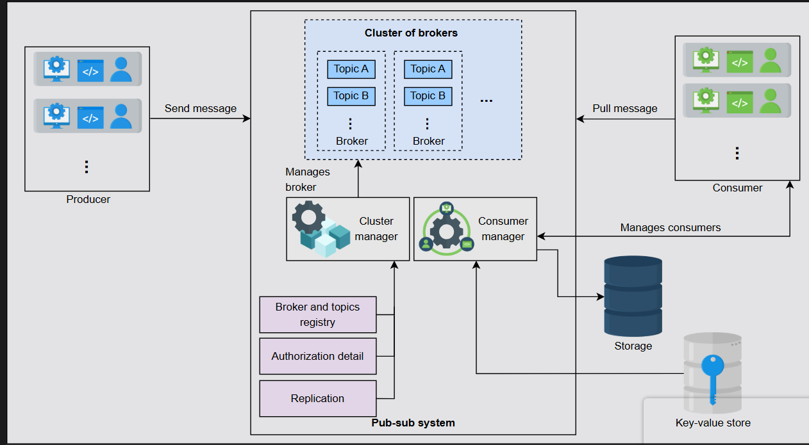

# Pub-sub

## 📌 System Design: The Pub-sub Abstraction

### 🔍 What is a Pub-sub System?
**Publish-subscribe messaging**, often known as **pub-sub messaging**, is an asynchronous service-to-service communication method widely used in **serverless and microservices architectures**.  
Messages can be sent asynchronously to different subsystems of a system using the pub-sub system.

All the services subscribed to the pub-sub model receive the message that’s pushed into the system.  
For example, when a **famous athlete posts on Instagram or shares a tweet**, all their followers are updated.  
Here:
- The **athlete is the publisher**
- The **post or tweet is the message**
- All their **followers are subscribers**

### 🔗 Pub-sub System


### 🎯 Motivation
The **hardware infrastructure** of distributed systems consists of **millions of machines**.  
Using a **pub-sub system** to communicate asynchronously **increases scalability**.

- **Producers and consumers** are disconnected and operate **independently**, allowing them to scale and develop separately.
- The **decoupling between components** (producers and consumers) allows **greater scalability** since **adding or removing** any component **doesn’t affect** the others.

### 🏗️ How Do We Design a Pub-sub System?
We have divided the **pub-sub system design** into the following lessons:

#### 📝 Introduction
In this lesson, we learn about the **use cases** of the pub-sub system, define its **requirements**, and design the **API** for it.

#### 🏛️ Design
In this lesson, we discuss **two designs** of the pub-sub system:
1. **With messaging queues**
2. **With a broker**

---

## 📌 Introduction to Pub-sub

**Learn about the use cases of the pub-sub system, how to define its requirements, and design the API for it.**

### 🔍 Use Cases of Pub-sub  
A pub-sub system offers **asynchronous communication**, making it useful in several scenarios:

- **⚡ Improved Performance:** Push-based distribution speeds up response times and reduces delivery latency.  
- **📥 Handling Ingestion:** Helps process large amounts of **log data** to derive **user behavior insights** and event tracking. Systems like Meta's **Scribe** use this for data management.  
- **📡 Real-time Monitoring:** Enables applications to monitor raw or processed messages in real time.  
- **🔄 Replicating Data:** Supports **leader-follower protocols**, allowing followers to update asynchronously. Even apps like **WhatsApp** use pub-sub for synchronized multi-device views.

### 🎯 Motivation for Pub-sub  
The **pub-sub system enhances scalability** by decoupling **producers and consumers**, allowing independent operation.

- **📈 Increased Scalability** — Components work autonomously.  
- **🚀 Boosted Performance** — Enables quick data distribution and consumption.  
- **🔄 Asynchronous Replication** — Helps in efficient **data refreshes and distribution**.

### ✅ Requirements  

#### 🏗️ Functional Requirements  
A **pub-sub system** must meet the following functional criteria:  

- **Create a Topic:** Producers should be able to create new topics.  
- **Write Messages:** Producers should write messages to the topic.  
- **Subscribe to Topics:** Consumers should subscribe to receive messages.  
- **Read Messages:** Consumers should fetch messages from a topic.  
- **Retention Time Specification:** Consumers should define message retention periods.  
- **Delete Messages:** Messages should be removed after the retention period.

#### 🔧 Non-functional Requirements  
Beyond core functionality, a pub-sub system must ensure:  

- **⚖️ Scalability:** Should scale with **increased topics** and **traffic**.  
- **✅ High Availability:** Producers should always be able to write, and consumers should always be able to read.  
- **🛡️ Durability:** Messages must not be lost and should reach intended subscribers.  
- **⚠️ Fault Tolerance:** Should continue operation **even during failures**.  
- **🔄 Concurrency Handling:** Should effectively manage simultaneous read/write operations.

### 🔗 API Design  

#### 🏗️ Create a Topic  
```python
create(topic_ID, topic_name)
```
Returns an **acknowledgment** on success or **error** on failure.

#### ✍️ Write a Message
```python
write(topic_ID, message)
```
Adds a **message** to a **topic**, ensuring **delivery**.

#### 📩 Read a Message
```python
read(topic_ID)
```
Fetches **data from the topic** and returns the **message object**.

#### 🔔 Subscribe to a Topic
```python
subscribe(topic_ID)
```
Adds **the consumer** as a **subscriber** to a topic.

#### 🚫 Unsubscribe from a Topic
```python
unsubscribe(topic_ID)
```
Removes **the consumer** from a **topic subscription**.

#### 🗑️ Delete a Topic
```python
delete_topic(topic_ID)
```
Deletes a **topic** based on its **topic_ID**.

### 🏗️ Building Blocks
The **pub-sub system design** relies on essential components:

- **🗄️ Database:** Stores **subscription details**.
- **📬 Distributed Messaging Queue:** Stores **messages sent by producers**.
- **🔑 Key-Value Store:** Maintains **consumer information**.

---

## 📌 Design of a Pub-sub System

### 🔍 Introduction
Dive into designing a **pub-sub system** and its components.

### 🏗️ First Design
In the previous lesson, we discussed that a **producer writes into topics**, and **consumers subscribe** to a topic to read messages from that topic.  
Since new messages are added at the end of the queue, we can use **distributed messaging queues** for topics.

### 🗄️ Components
- **Topic Queue:** Each topic will be a **distributed messaging queue** to store messages from the producer.
- **Database:** A **relational database** will store subscription details, ensuring **data integrity**.
- **Message Director:** Reads messages from the topic queue, fetches consumers from the database, and sends messages to the consumer queue.
- **Consumer Queue:** Each consumer will have a **separate distributed queue** to read messages.
- **Subscriber Service:** Adds an entry into the database when a consumer subscribes to a topic.
- **Fail-over Services:** Used for **message director and subscriber** to guard against failures.

### ⚖️ Trade-offs in Distributed Messaging Queues
Using **distributed messaging queues** makes the design simple. However, maintaining **millions of queues** for thousands of topics is **expensive**.  
Additionally, copying the same message into all subscriber queues leads to **unnecessary duplication** and **storage overhead**.

### 💡 Optimization Idea
Instead of maintaining a **separate queue for each reader**, we can add a **counter for each message**.
- The **counter decrements** as subscribers consume the message.
- The message **is not deleted** until the counter reaches **zero**.
- This eliminates the need for **separate queues** for each reader.

---

## 🔗 Second Design

### 🏛️ High-level Design
The **pub-sub system** will have the following components:

- **Broker:** Stores messages from the producer and allows consumers to read them.
- **Cluster Manager:** Supervises broker health and **notifies failures**.
- **Storage:** A **relational database** stores consumer details, including **subscription information** and **retention periods**.
- **Consumer Manager:** Manages consumers, verifying **authorization** and **message access**.

### ✅ Design Considerations
- **Acknowledgment:** Producers receive confirmation when a message is stored successfully.
- **Retention Time:** Consumers can specify **how long messages should be retained**.
- **Message Ordering:** Messages are stored in **segments** with **offset addresses** for strict ordering.
- **Partitioning:** Topics are split into **multiple partitions** to improve **availability** and **scalability**.

### 🔄 Cluster Manager Responsibilities
- **Broker and Topics Registry:** Stores the list of topics for each broker.
- **Replication Management:** Uses a **leader-follower approach** to ensure **fault tolerance**.
- **Metadata Updates:** Ensures **replica consistency** across brokers.

### 🔑 Consumer Manager Responsibilities
- **Verify Consumer Access:** Ensures consumers can only read **authorized topics**.
- **Retention Time Management:** Restricts access based on **message expiration**.
- **Push vs. Pull Mechanism:** Supports both **automatic message pushing** and **consumer-initiated reads**.
- **Multiple Reads Handling:** Uses a **key-value store** to track **consumer offsets** for efficient message retrieval.

---

## 🎯 Finalized Design
The **finalized pub-sub system** integrates:
- **Cluster of Brokers** for **message storage and retrieval**.
- **Key-value Store** for **consumer authorization details**.
- **Replication Management** for **fault tolerance**.
- **Consumer Manager** for **subscription handling**.

### 🏁 Conclusion
We explored **two designs** of a **pub-sub system**:
1. **Using distributed messaging queues**
2. **Using a broker-based approach**

The **pub-sub system** enables **scalability**, **fault tolerance**, and **efficient data consumption**, making it a **preferred choice** for large-scale systems.

---

