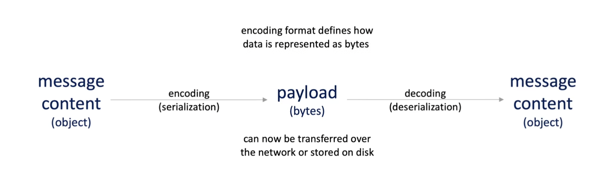
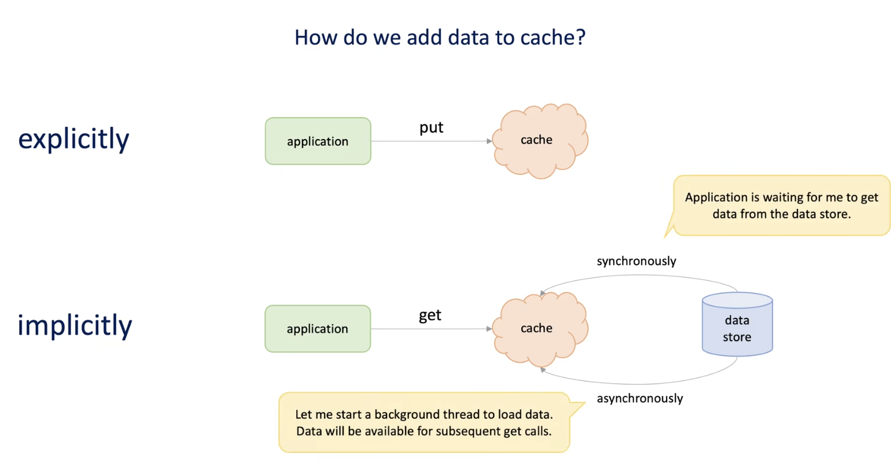
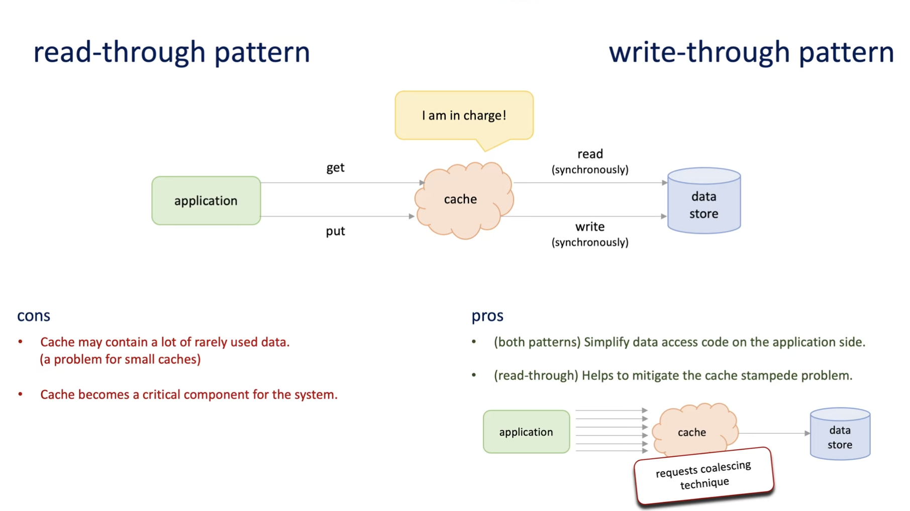
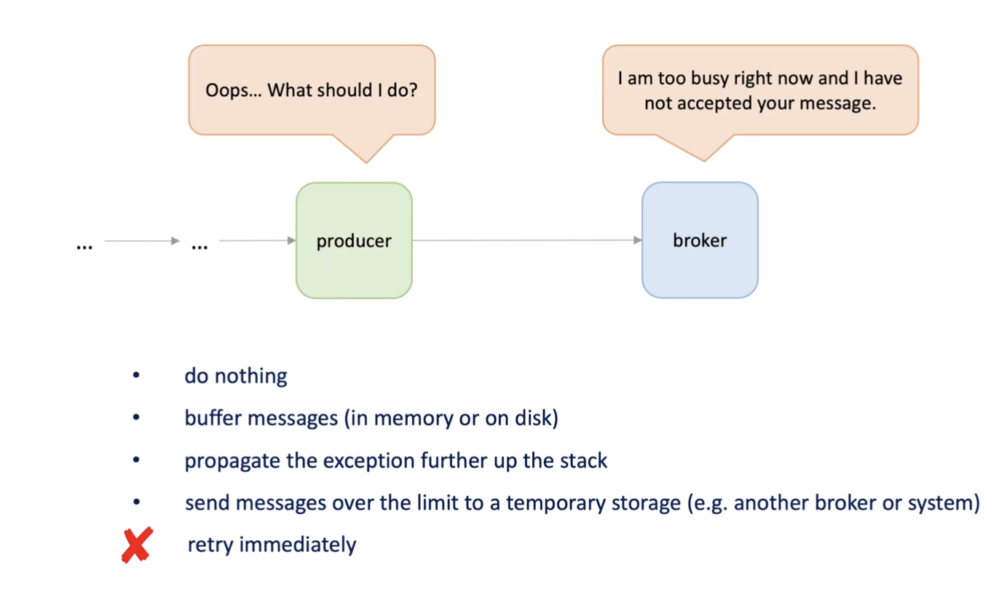

# High Level System Design

What is System Design
-----
1. Deciding the architecture, components and modules in each component and interaction between them.

What will we do when we design a system
--------------------------------------
1. break down problem statement into solvable sub-problems.
2. decide on key components and responsibilities
3. decide on boundaries of each component
4. touch upon key challenges in scaling it
5. make our architecture fault tolerant and available

How to approach System Design! 
------------------------------
1. System Design is extremely practical
and there is a structured way to tackle the situations.
Take baby steps, no matter what!
2. understand the problem statement.
   1. Without having a thorough understanding of the problem at hand, we would easily digress.
3. Breakdown the problem
   1. Example: Design Facebook
      1. Think in features
         2. Feed, Auth, Notifications. etc.
   2. Pick subproblem and go deep into it
        
4. For each subcomponent, look into
   1. Database and Caching
   2. Scaling & Fault Tolerance
   3. Async processing (Delegation)
   4. Communication
5. Dissect each component (if required)
   1. Example: Generator in Feed
      

How do you know that you have built a good system?
-------------
1. The System is broken down to subcomponents
2. Every component has a clear exclusive set of responsibilities
   1. Feed Web Server -> serves feed over HTTP
   2. Feed Generator -> Pulls data from multiple services and puts them in DB
   3. Feed Aggregater -> combines candidate items fetch be generator filters out redundant, ranks and creates a final consumable feed.
3. For each subcomponent following is figured out
   1. Database and Caching
   2. Scaling & Fault Tolerance
   3. Async processing (Delegation)
   4. Communication
4. Each component (in isolation) is
   1. Scalable  →  horizontally scalable
   2. fault-tolerant → plan for recovery of data mostly in case of a failure ↳ to a stable state
   3. available → component functions even when some component "fails"

Interview Perceptive
--------------------

How to define system requirements
--------------------------------
1. Functional Requirements
   1. We need to identify `who` is going to use the system and `how`, What is `input` and `output` for abstract systems
   
   2. Define Api for actions
   
2. Summary
   
   
   

Infrastructure to achieve the non-functional requirements
---------------------------------------
1. Servers
   1. CPU 
   2. Memory Size
   3. Disk
   4. Network IO
   5. Decision
      1. We decide the server optimized to one or more of the following properties like whether cpu heavy, disk heavy, etc.
   6. Usually CPU is easier to scale and network IO is hard to scale
2. Rack
   1. Servers are physically easier to reach, examine, and manipulate.
   2. Simplifies cooling and increases security.
   3. Has its own network and power source.
   4. To increase availability, we can place servers in different racks.
   5. To reduce latency, we can place servers
      in the same rack.
3. Data Center
   1. Group of racks
   2. Has independent power, cooling, and physical security.
   3. May become unavailable due to power outage, earthquake.
4. Availability Zones
   1. Group of datacenters
   2. Increases availability as hardware is distributed across multiple data centers.
   3. Increases scalability as there are
      multiple places to allocate hardware from.
5. Regions
   1. Group of availability zones
   2. Within a radius of 100 km.
   3. AZS in a region are interconnected with high-bandwidth and low-latency networking.

6. Helps in achieving some non-functional requriments
   1. Deploying in multiple regions to tackle world wide traffic
      1. we deploy a copy of the system to every region worldwide
      2.  improves performance—the system is physically closer to users
      3.  increases availability—we can forward requests to other regions 
      4. improves scalability—more hardware is available for allocation
   2. In each availability zone 
      1. increases durability—we can replicate data quickly between zones within each data center
      2. we deploy to servers in different racks 
      3.  we choose the server type based on the workload it expects to run

Fundamentals of reliable, scalable, and fast communication
--------------------------------
1. Synchronous vs asynchronous communication
   1. Synchronous and asynchronous request response
      
   2. Asynchronous communication
      
2. Messaging solves many problems
   
3. Choice is made on client requirement
   

Asynchronous messaging patterns
------------------
1. Message Queue
   1. Usually a Single Receiver
2. Publish and Subscribe Model
   1. Multiple Receivers
3. Example
   
4. Tak Queue - Competing Consumers
   
5. Request - Response Pattern
   
6. Priority Queue
   1. Some third party queues come with some priority algo - Reshuffle algo
      
   2. Otherwise, have different queues having priority for each
      
7. Claim Check - Large files stored on shared storage, and only meta-data is shared via queue
   

Network Protocols
----------------
1. TCP - prioritizes reliability over time
   1. connection-oriented
      1. connection between client and server is established before data can be sent
   2. handshake
      1. a 3-step connection establishment process
   3. reliable - lost packets are detected and retransmitted via following techniques
      1. sequence numbers—allow receivers to discard duplicate packets and
         properly sequence reordered packets
      2. acknowledgments — allow senders to determine when to retransmit lost packets
      3. order-all bytes received will be in the same order as those sent
   4. checksums-ensure data correctness
   5. flow control-limit the rate a sender transfers data to a receiver
   6. congestion control-the rate of data entering the network is controlled
2. UDP - prioritizes time over reliability
   1. Cons
      1. no connection-sender transmits messages to the receiver without verifying the readiness or state of the receiver
      2. no reliability-messages may get lost on the way
      3. no acknowledgments
      4. no retransmission
      5. no order 
      6. no flow control
      7. no congestion control
   2. Pros
      1. checksums-ensure data correctness
      2. broadcast-a single message can be transferred to all recipients on the subnet simultaneously
      3. multicast-a single message is routed only to intended recipients
   3. Use cases—applications where latency is a critical concern and we can afford losing packets occasionally
      1. video and audio live-streaming
      2. automatic detection of devices and services on a computer network
      3. online games
3. HTTP
   1. request/response Model
      the client submits an HTTP request message to the server and the server sends back an HTTP response message
   2. TCP-older HTTP protocol versions use TCP as an underlying transport protocol
   3. QUIC-HTTP/3 uses QUIC protocol as a transport
      1. Built and top UDP(decreased latency) and has features of TCP(reliability)
   4. Persistent connection-a single TCP connection can be reused for more than one request
   5. multiplexing-multiple requests are sent over the same TCP connection without waiting for responses
   6. HTTP compression-allows content to be compressed on the server before transmission to the client.
   7. Request
      
   8. Response
      

Blocking vs non-blocking I/O
-----------------
1. Connection - is a combination of Socket (IP + port number) of client and server
   
2. Every Client have emphreal ports(short lived port assignment) to allow multiple connections.
   1. Ephemeral ports are temporary port numbers assigned by an operating system to a client application for the duration of a single network connection. They allow multiple connections by providing unique port numbers to each connection, which helps manage network traffic and maintain the separation of multiple connections from the same client.
   
3. Blocking vs non-blocking I/O - Thread Level
   1. Blocking I/O
      1. Behavior: In blocking I/O, system calls wait (or "block") until they can be completed. For instance, if you call recv on a socket and there is no data available, the call will block until data arrives.
      2. Simplicity: Easier to understand and implement, as the program waits for the operation to complete before proceeding.
      3. Use Case: Suitable for single-threaded applications where simplicity is more critical than performance or responsiveness.
   2. Non-Blocking I/O
      1. Behavior: In non-blocking I/O, system calls return immediately if they cannot be completed right away. For example, recv will return an error if no data is available instead of waiting.
      2. Complexity: More complex to implement because you have to handle cases where the operation is not yet complete.
      3. Use Case: Suitable for applications that require high performance, such as servers handling many simultaneous connections, where you do not want to block a thread for each connection.
   
4. I/O vs Worker Thread
   1. Practical Example: In a web server scenario, an I/O thread might handle the initial receipt of web requests, which involves waiting for data to be sent over the network. Once the data is received, the processing of the request, such as generating a response, might be handed over to a worker thread. This separation allows the I/O thread to return to handling other incoming I/O requests rather than being tied up with computational tasks
5. Variations in used in practice
   
   
5. Concurrency vs parallelism 
   

Data encoding formats
-------------------

Message acknowledgment
---------

Improving Performance with Cache
----------------------
1. Cache is limited it cache get fulled old items will be removed
2. Types of Cache
   
3. How to add to a Cache
   1. Explicitly - Data is intentionally added to cache
   2. Implicit—While get operation you observe certain data is not in cache so add it.
      
4. Delete Data in Cache 
   1. Size bases—once cache is fulled
   2. Time-based
   3. Explicitly remove
   
5. Refreshing the Cache to avoid sync read of data from data store
   
   
6. Handling Duplicates while caching
   1. Generate a Unique ID using Payload and store in cache
   
7. How to maintain freshness of data in cache compared to data in actual database
   1. Two Scenarios
      
      1. Application using both cache and database will be responsible
         
      2. or the cache is responsible to get the latest
         
         

Importance of Queues
------------------
1. Ways to Implement the data
   
2. Applications
   
3. Corner Cases
   
   1. Full
      
      1. Load Shedding
         
      2. Rate Limiting
         
      3. How to deal with Producer while load shedding or rate limiting
         
      4. Back Pressure - Don't accept the connection
         
      5. How to deal with producer back Pressure—same as above
      6. AutoScale
         
      7. Case of Empty Queue
         
4. Blocking queue and producer-consumer pattern
   1. Blocking when queue it full or empty
      
   2. Using a producer-consumer pattern instead of blocking queue
      
   3. Realtime Example
      
      
5. Thread Pool
   1. Each Thread for every request
      
   2. Using Queue to store the task
      
   3. How to size thread pool
      
   4. Dealing with Thread pool while shutdown
      

Data Store Internals - Cannot rely on in a memory database
--------------------
1. Cons of Storing messages in memory
   
2. Low Latency and High throughput can be achieved using disk as well
3. Data Log - Stores sequence of bytes
   
   1. How to deal with deleting once read and reading of one large Log
      1. Deleting - Having Sub segments 
         1. Append new Messages to active segment
         2. delete sub segment once read
         
      2. Reading—Having map of start position of message and segment
         
4. Index - How to store message position map and segment
   
5. 
6. Time Series Data - `Object Storage and Database pattern` to solve time series Info
   1. Example
      
   2. You can use log( segments and indexes)
   2. Simplified Architecture
      
   3. Current design support CURD as follows
      
   4. Concerns with design 
      
   5. Solution Problem One - Not deleting messages
      1. Log Compaction - Separate thread copies segments to another segment while deleting duplicate and deleted messages.
      
7. B - Trees - Improve the search operation by using index - primary key
   
   Realtime Example
   
8. Embedded Database instead of large databases
   1. Problem
      
   2. Solution
      
   3. Example - Rocks DB
      
      1. Handling Write
      
      2. Handling Read
      
      3. How Sorted List Help
      
      
   

   
      
         
   

   

Improvement of System
---------------
1. Add the cache to increase the performance
   
2. Interview Tip - Start with small think as single machine 
   
3. Big Compute Architecture—small system mapping to a distributed system
   
   
4. Batch Arch Pattern
   

   

   

      

      
